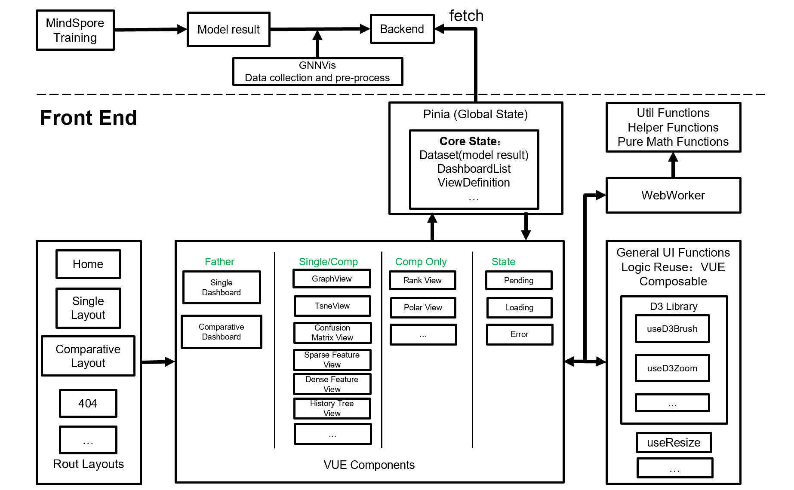
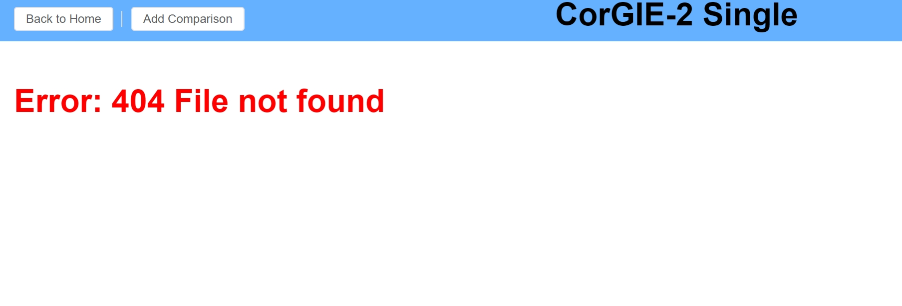
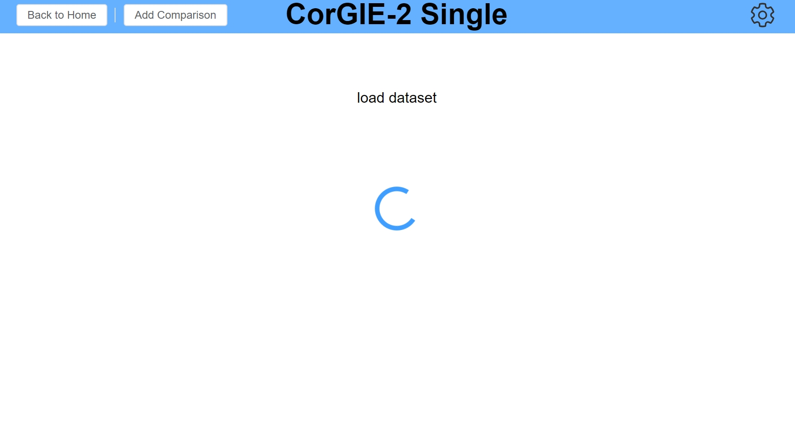

# CorGIE-2 柯基-2

一个由[Vue](https://vuejs.org/)实现的可视分析工具，用于调试和优化图神经网络训练模型，支持的任务：结点分类、链接预测、图分类等。


# 论文

即将到来……

# 核心特点
- 支持一个模型结果（训练结果）的探索，以及两个模型结果之间的比较。
- 一个**数据集**是一个输出数据集，换言之，一个GNN模型的完整的训练结果，它可以用一个可视化的**仪表盘**进行分析
- 每个仪表盘从集中状态管理工具（store）取得数据并在子**视图**中进行可视化渲染，可视化分为四个维度：拓扑空间、隐空间、预测空间。
- 结点可以在多个**视图**之间被相应性地选择或高亮。
- **结点选择**可以被**筛选**到一个新的仪表盘，以便于迭代分析或对比分析。
- 仪表盘生成的过程，同时也是分析的路径，可以被存储并可视化为树，并且这些仪表盘可以被还原。点击树中的两个结点可以实现**仪表盘之间的比较**。

# 快速启动

最低配置:
- 中央处理器：英特尔® 奔腾 G4560, 内存：8GB, 硬盘存储空间：不少于 HDD 10GB
- 你需要[nodejs](https://nodejs.org/en/download/) (版本>=16) 和 [python](https://python.org) (版本>=3.7.10).

克隆或下载源代码，然后：

首先，你需要运行python以启动一个后端服务器：

```bash
python ./backend/static_server.py
```

然后，你需要在一个新的命令终端中安装依赖，注意只需安装一次就够了

```bash
npm install
```

最后运行以下命令来启动前端：

```bash
npm run dev
```
一些案例数据集可以在 [/backend/backend.zip](./backend/backend.zip) 中找到，请解压到`backend`文件夹（如果遇到`是否替换`请选择`是`）。

# 在线试用

即将到来……

# 数据格式

请阅读[这里](./docs/data_format.md)。

# 用户手册

你可以阅读[这里](./docs/user_manual/README_CN.md)。

或者，如果你想在本地阅读用户手册，请按照以下步骤，因为我们使用 [docsify](https://docsify.js.org/) 撰写用户手册。

- 如果你有 [nodejs](https://nodejs.org/en/download/):

  ```bash
  npm i docsify-cli -g
  ```
  然后去往项目文件夹, 运行：
  ```bash
  docsify serve ./docs/user_manual
  ```
  然后打开浏览器（通常是浏览器）并输入网址 [http://localhost:3000](http://localhost:3000) 来阅读用户手册。
- 或者，你可以
  
  ```bash
  cd ./docs/user_manual
  python -m http.server 3000
  ```
  然后打开浏览器并输入网址 [http://localhost:3000](http://localhost:3000) 来阅读用户手册。


# 实现

## 概览

- 使用 [Pinia](https://pinia.vuejs.org/) 提供数据集和全局状态管理。
- 使用 [Vue Router](https://router.vuejs.org/) 管理路由。
- 使用 [Element Plus](https://doc-archive.element-plus.org/#/zh-CN/component/installation) 开发布局组件。
- 所有的Vue组件都是由 [Typescript](https://www.typescriptlang.org/) 语言、以[SFC（单文件组件）](https://vuejs.org/guide/scaling-up/sfc.html) 风格和 [Composition API（组合式API）](https://vuejs.org/guide/extras/composition-api-faq.html)编程。
- 架构:
  

## 工作流

- 一个模型结果作为文件夹被放置在`backend`目录。
- 进入一个路由路径时，`fetch`模型结果并且存储在`store`中的`DatasetList`。
- 然后做一些初始计算，进入第一个单模型的或双模型的 `Dashboard（仪表盘）`, 它被定义在`store`的`DashboardList`。
- 当初始化一个新的`Dashboard（仪表盘）`时，我们也按照不同的任务类型（结点分类、链接预测、图分类）初始化这个仪表盘的`View（视图）`列表。此列表存放在各`Dashboard（仪表盘）`对象中。
- 我们把放置`View（视图）`的`Dashboard（仪表盘）`定义为`flex`的css布局，每个`View（视图）`放置在一个由[slot](https://vuejs.org/guide/components/slots.html#slots)实现的`ResizableBox（可放缩盒子）`中。
- 当在不同的视图中选择或高亮一些结点集时，我们把这些信息公共地存放在`store`中的`Dashboard（仪表盘）`对象（而非 `View（视图）`对象中。
- 当用所选结点生成一个新的`Dashboard（仪表盘）` 时, 这些所选结点将成为新`Dashboard（仪表盘）`的源结点。
- 为了提高代码复用性，`brush（刷选）`，`zoom（放缩）`，`resize（改变大小）`以及一些其他功能被定义为[组合式函数](https://vuejs.org/guide/reusability/composables.html)或[自定义指令](https://vuejs.org/guide/reusability/custom-directives.html#introduction)。
- 在很多散点图中，我们使用条件渲染来渲染不同的语义的结点的坐标。

## 文件和目录信息

```bash
├── LICENSE 
├── README.md
├── backend      # 静态服务器和数据集存放文件夹
│   ├── cora-gae # 数据集的名字，也作为路由路径
│   │   ├── graph.json 
│   │   ├── initial-layout.json
│   │   ├── node-embeddings-tsne-result.csv
│   │   ├── node-embeddings.csv
│   │   ├── prediction-results.json
│   │   └── true-labels.txt
│   ├── ... # other datasets
│   │   └── ...
│   │
│   ├── gnnvis.py        # 后端数据预处理的python文件
│   ├── list.json        # 数据集的列表，也作为主页上的路由的列表
│   └── static_server.py # 一个简单的后端服务器
├── docs                 # 文档和一些markdowns
│   ├── architecture.png
│   ├── data_format.md
│   ├── tree.txt
│   └── user_manual.md
├── public
│   ├── favicon.ico           # 网站小图标
│   └── workers               # web-workers（用于开启额外线程给js加速）中用到的js脚本
│       ├── bitset.js         # 离线版本: bitset（位集）用于集合运算
│       ├── d3js.org_d3.v7.js # 离线版本: d3库（可视化库）
│       ├── tsne.js           # 离线版本: tsne 降维算法
│       ├── distance.js       # 一些距离运算
│       └── forceLayout.js    # 图的力导向布局
├── src
│   ├── App.vue                          # 最根部的vue组件
│   ├── api   
│   │   └── api.ts                       # 前端用于和后端通信的API接口字符串
│   ├── assets                           # 根部的css样式文件（不重要）
│   │   ├── main.css
│   │   └── material-icons.css
│   ├── components                       # vue组件
│   │   ├── footer                       # 放在底部footer中的组件
│   │   │   └── tree.vue                 # 历史记录树视图
│   │   ├── header                       # 放在顶部header中的组件
│   │   │   └── scatterSymbolLegend.vue  # 散点图中的结点图例
│   │   ├── icon                         # 一些按钮的图标
│   │   │   ├── CarbonCenterToFit.vue    
│   │   │   └── ...
│   │   ├── plugin                       # 逻辑复用的插件们
│   │   │   ├── useD3Brush.ts            # 使用Vue组合式函数实现的d3库的刷选
│   │   │   ├── useD3Zoom.ts             # 使用Vue组合式函数实现的d3库的放缩
│   │   │   └── useResize.ts             # 改变视图大小的逻辑，向外暴露视窗尺寸及尺寸的变化
│   │   │
│   │   ├── publicViews                     # 单模型仪表盘和双模型结果比较的仪表盘都公共用到的视图
│   │   │   ├── graphHeader.vue             # 图（graph）视图的标题头，包含图的力导向布局的一些设置
│   │   │   ├── graphRenderer.vue           # 图（graph）视图的主题，也即力导向布局渲染部分， 一般包括结点和链接
│   │   │   ├── multiGraphHeader.vue        # 多图视图的标题头，包含一些多图的设置
│   │   │   ├── multiGraphRenderer.vue      # 多图视图的渲染部分，即网格化的多个力导向图布局
│   │   │   ├── denseFeatureHeader.vue      # 结点稠密特征视图的标题头，包含稠密特征一些的设置
│   │   │   ├── denseFeatureRenderer.vue    # 结点稠密特征视图的渲染部分，主要以频率直方图的形式呈现
│   │   │   ├── sparseFeatureHeader.vue     # 结点稀疏特征视图的标题头，包含稀疏特征的一些设置
│   │   │   ├── sparseFeatureRenderer.vue   # 结点稀疏特征视图的渲染部分，即可以放缩的色彩矩阵
│   │   │   ├── graphFeatureHeader.vue      # 图特征视图的标题头，包含图特征的一些设置
│   │   │   ├── graphFeatureRenderer.vue    # 图特征视图的渲染部分，以异步形式呈现的多个频率直方图
│   │   │   ├── confusionMatrixRenderer.vue # 同时用于结点和图的混淆矩阵
│   │   │   ├── linkPredHeader.vue          # 链接预测视图的标题头，包含链接预测的一些设置
│   │   │   ├── linkPredRenderer.vue        # 链接预测视图的渲染部分，以力导向布局的形式呈现，其中不同类型的边用不同的颜色编码
│   │   │   ├── topoLatentDensityHeader.vue # 拓扑-隐空间密度联合视图的标题图，包含该视图的一些设置
│   │   │   ├── topoLatentDensityRenderer.vue # 拓扑-隐空间密度联合视图的渲染部分，以力导向布局形式呈现，结点颜色用灰度插值
│   │   │   ├── tsneHeader.vue              # 结点嵌入降维视图的标题头，包含结点嵌入降维的一些设置
│   │   │   ├── tsneRenderer.vue            # 结点嵌入降维视图的渲染部分，一般以散点图形式呈现
│   │   │   ├── graphTsneHeader.vue         # 图嵌入降维视图的标题头，包含图嵌入降维的一些设置
│   │   │   ├── graphTsneRenderer.vue       # 图嵌入降维视图的渲染部分，一般以散点图形式呈现
│   │   │   ├── publicHeader.vue            # 视图容器的公共标题头，包含视图的名称和一些公共的按钮
│   │   │   └── resizableBox.vue            # 视图的公共容器，可以放缩
│   │   ├── comparison                      # 仅用于双模型结果比较的仪表盘的视图
│   │   │   ├── polarHeader.vue             # 极坐标视图的标题头
│   │   │   ├── polarRenderer.vue           # 极坐标视图的渲染部分，一个创新式的极坐标可视化视图
│   │   │   ├── rankHeader.vue              # 排名视图的标题头
│   │   │   └── rankRenderer.vue            # 排名视图的渲染部分，创新地对两个嵌入空间的结点排名差异进行可视化
│   │   ├── state                           # 一些公共状态组件
│   │   │   ├── Error.vue
│   │   │   ├── Loading.vue
│   │   │   └── Pending.vue
│   │   ├── singleDashboardView.vue         # 单模型结果的仪表盘
│   │   └── compDashboardView.vue           # 双模型结果比较的仪表盘
│   ├── layouts                             # 路由布局
│   │   ├── homeLayout.vue
│   │   ├── notFoundLayout.vue
│   │   ├── compareLayout.vue
│   │   └── singleLayout.vue
│   ├── main.ts                             # 前端js的入口
│   ├── router
│   │   └── router.ts                       # 路由定义
│   ├── stores
│   │   ├── enums.ts                        # 一些枚举常量
│   │   └── store.ts                        # 全局状态
│   ├── types
│   │   ├── typeFuncs.ts                    # 一些类型守卫函数
│   │   └── types.d.ts                      # 类型定义，所有的类型定义都在这一个文件中
│   └── utils                               # 一些辅助函数或纯函数
│       ├── graphUtils.ts                   # 一些图计算的函数
│       ├── myWebWorker.ts                  # 用于给js开启额外线程加速的web-worker的实现
│       └── otherUtils.ts                   # 一些几何运算、和网页DOM元素相关的运算
├── index.html                              # 起始网页
├── package-lock.json                       # 在node开发环境中，本项目的全部依赖包（递归）
├── package.json                            # 在node开发环境中，本项目的直接依赖包
├── env.d.ts                                # typescript的一些设置
├── tsconfig.app.json                       # typescript的一些设置
├── tsconfig.json                           # typescript的一些设置
├── tsconfig.node.json                      # typescript的一些设置
├── vite.config.js                          # 打包工具的一些设置
└── vite.config.ts                          # 打包工具的一些设置
```
有关文件的更多信息，请阅读代码。
 
> 对于代码注释中的混合中英文，我们深表歉意。 :-)


# 常见问题解答
> 故障排除

1. 碰见"Error: 404 File not found"我该怎么做？
- 
- > 这可能是数据集缺失或者数据集不完整导致的, 检查 `backend\list.json` 确保这条数据集不是多余的，并且检查 `backend\${你的数据集名称}`来确保数据集是完整的。

2. "load dataset（加载数据集）"的过程太长怎么办？

- 
- > 这可能是因为您的计算机性能过低，可以尝试关闭其他无关程序并重启浏览器；或者是因为数据集过大，您可以使用其他可以用GPU加速的语言库预计算图布局和降维数据。


