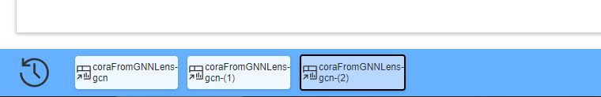

# User Manual

Hi, it's a user manual to teach you how to use CorGIE-2.

Basically, you can go to those sections to read:

- [Layouts](#layouts)
- [Dashboards](#dashboards)
- [Tasks & Views](#tasks_and_views)

# Layouts

<span id="layouts"></span>

The `layout` concept is the real page of vue route, also is the whole user interface of this system.

## Home Layout

When user enters into the home page, there will be a list of available datasets, with their name, taskType, trained model and other information.

User can click `Analyze` button (as shown in fig) to enter the analytical process of one dataset through Single Dashboard.


---

When user clicks button `Compare`, the list will be filtered into a subset which only contains dataset from exact same graph (As shown in below fig).


Then, the user can click the `+` button to enter the layout of model-wise comparative Dashboard.

## Dashboard Layout

Dashboard Layout contains 3 parts: `Header`, `Main` and `Footer`.


### Header

<span id="global_settings" ></span>

In header, there is an **Global Setting** button, which contains the following options:

- Global label type: whether to use `true label` or `predict label` in all Dashboards. When toggled, the labels will change immediately.
- Default(Global) select mode: since many views have implemented the `brush` function to enable nodes selection, user can toggle this to decide a continuous selecting behavior or reselect new nodes subsets every time. Note that this setting will change immediately when toggled.
- Rescale when: Each view in each dashboard can be resized to arbitrary size(width, height), and the coords will change simultaneously. But for the consideration of rendering optimization, user can choose to rescale the coords when the resize action is finished. Note that this setting will change immediately when toggled.
- Max recent length: the maximum dashboards that show in the navigation bar.
- Settings trigger mode: the gesture to trigger the popover setting menus. Note that this setting will change immediately when toggled.


---

Note, if it's a dashboard for single dataset(model result), there will be an `Add Comparison` button. When it is clicked, the datasets will be auto filtered into ones that share same origin graph with current model result. As shown in the following fig.


### Footer

In footer, the left section displays recently visited dashboards with max len at 3 by default.



Hover on the button and the [principal view](#principal_view) of the dashboard will emerge. Click button to navigate to the target dashboard.


---

<span id="tree_view"></span>

At the right-bottom corner lays a **tree** icon, which, on hovered, will show the history path of dashboards. When nodes selected from an old dashboard and filtered into new ones, the parent-son relationship between two dashboards will be recorded as hierarchical data, thus can be visualized as a tree or directed acyclic graph(DAG).


In the tree view, each dashboard can be abstracted as a tree node and the relationship can be regarded as links. Like the navigation bar, we represent each dashboard with the snapshot of its [principal view](#principal_view). Click a snapshot and then click `goto` to navigate to the target dashboard.

---

For dashboard-wise comparison, user can click two snapshots and then click `compare`, to create a new dashboard for comparative analysis. As is shown in the following fig.


Unlike nodes in the tree, when the snapshot of the comparative dashboard is clicked, it will directly change to the new dashboard.

# Dashboards

<span id="dashboards"></span>

The dashboards is a multi-view visualization for selected nodes subsets. The first dashboard consider all nodes from model result as inputs, while the descendant dashboards accept the selected nodes and their neighbor nodes by hops as inputs in an iterative process.

A dashboard consists of Header and Body. The Header has title, `FILTER!` button, `clear selection` button, `restore views sizes` button, `represent` button, `scatter legend` icon, and `settings` button. The body is defined as [flex layout](https://developer.mozilla.org/en-US/docs/Web/CSS/CSS_Flexible_Box_Layout/Basic_Concepts_of_Flexbox) to incorporate views, which facilitates users to decide their own layouts of views.


## Taxonomy of Dashboard

Currently, we have **single Dashboard** for one model result visualization, and model-wise comparative dashboard for two model result comparison.

Also, in [tree view](#tree_view), user can select two dashboard to generate dashboard-wise comparative dashboard to analyze the difference between two single dashboards.

## FILTER & Clear

<span id='filter_clear'></span>

When user has selected a group of interested nodes and then clicks the `FILTER` button, the neighbor nodes of the selected nodes will be calculated and a new dashboard will be created and rendered.


Once the new dashboard is created, the selected nodes and their neighbors will naturally become the source nodes of the new dashboard, as with most of the views in this dashboard.

---

The `clear` button can be hovered, and different entries of nodes selections will be shown as a list, as some views may take different entries of nodes as sources.


User can inspect the **description** of each entry and decide to clear which one.

When the `clear` button is clicked, `public` nodes selection will be cleared by default.

Alternatively, user can clear the `public` nodes selection every time selecting new nodes by trigger the setting `auto clear` in [dashboard settings](#dashboard_settings) or [global settings](#global_settings).

## Restore View Sizes

When user click the `restore view sizes` button, all views will be resized to their original sizes, with their contents rescaled.


## Principal View & Represented Dashboard

<span id="principal_view"></span>

In a dashboard, a view that is frequently interacted or in which nodes are largely selected may embody critical features and thus can represent its belonging dashboard. We call this view **Principal View** of the dashboard.

When the `represent` button is clicked, the size of the dashboard will be decreased and only the principal view will be shown. User can drag the represented dashboard as if it floats above all layers, to capture a instantaneous comparison with other dashboards.


Alteratively, when the `represent` button is hovered, all snapshots of views in the dashboard will be calculated, and user can click one of them to manually select a view as principal view to represent the dashboard.


---

Click the `max` button to maximize the dashboard to its original appearance and click the `min` buttons hide the dashboard to the navigation bar in footer.


## Scatter Legends

<span id="scatter_legends"></span>

Many views uses different symbols to show different nodes, necessitating a consistent and easy-get legends. Hover on the legend icon to show it.


Specially, in dashboard-wise comparison, to distinguish which dashboard does the nodes come from, we designed half filled symbols, as is illustrated in the above fig. For short, symbols for other hops are designed like-wise.

When a circle denotes a whole graph rather than a node, it's possible that both of the source dashboard contains nodes selection that includes the graph, thus we render this info with sector in a circle by percent.

## Other Settings of Dashboard

<span id="dashboard_settings"></span>

Like [global settings](#global_settings), dashboard has some public settings, which are only effective in the current dashboard.


Specially, by toggling `Highlight corresponding node` user can determine whether to highlight the same node or nodes group across views in the current dashboard, see [nodes highlighting](#nodes_highlighting). It's `true` by default.

# Tasks & Views

<span id="tasks_and_views"></span>

Currently we support 3 main tasks: **node classification**, **link prediction**, and **graph classification**.

We also support two model result comparison and two dashboard comparison(nodes selection comparison).

Given different tasks, a dashboard will have different prescriptions of views, say, _what views does the current dashboard have?_

## Public Features of Views

All views consists of a head part and a body part. In head part, there are some buttons frequently used functions and a setting button for some optional settings.


### Resizable

All views are wrapped in resizable boxes. The size of the view can be changed by dragging the handle at the right-bottom corner of the box, and the content will be automatically rescaled to suit the size. As shown below.


For performance considerations, you can change the time when to rescale the contents in [dashboard settings](#dashboard_settings) or [global settings](#global_settings).

### Swap

User can change the arrangement and order of the views by drag the title of each view.


### Nodes Highlighting

<span id="nodes_highlighting"></span>

Most of the views have implemented nodes highlighting. When a node or a part of nodes is hovered by mouse semantically, other views will highlight them through opacity or other visual channels.


### Pan and Zoom

Most of the views have implemented pan and zoom. By default, user can zoom in or out through mouse scrolling. But pan behavior conflicts with brush(see [Nodes Selections](#nodes_selections)). User can click the `pan` button to enable pan behavior. Switching from `brush` to `pan` will not clear nodes selections.


User can click the `reset zoom` to transform the content into a proper size in the box.


### Nodes Selections

Most of the views have implemented nodes selection behavior, like **d3-brush** in many scatter plots and **double click** in some histograms. Once the interested nodes are selected, they will be rendered correspondingly across views in current dashboard, usually in black-stroked circles in scatter plots.


Usually, click `brush` button to enable brush behavior.


**NOTE** that some views may have different nodes entries as source or target, which seem like nodes selections at the second time or third time.

**NOTE**: In graph classification, when some nodes are selected, they may not constituent a complete graph, but we still count the origin complete graph in many cases.

### Neighbor Discrimination

<span id="neighbor_discrimination"></span>

When user has selected some nodes and [FILTER](#filter_clear)s them to create a new dashboard, selected nodes and their hop neighbors will be calculated, together to become the source nodes of the new dashboard. Thus, it's significant to discriminate selected nodes and their neighbors.

We use different symbols to encode different hop neighbors. Take the below fig, the circles(●) are selected nodes(from parent dashboard), the triangles(▲) are 1-hop neighbors, and the rectangles(■) are 2-hop neighbors.


NOTE: All scatter views have utilized this visual encodings, for more symbols, please refer to [scatter legends](#scatter_legends).

### Dashboard Discrimination

<span id="dashboard_discrimination" ></span>

When user compares two dashboards through [history tree view](#tree_view), it's necessary to discriminate the nodes from dashboard-0 or dashboard-1.

For scatter views, we use different filling style on symbols to encode dashboard sources. Take the below fig, left filled symbols(◐) are nodes from dashboard-0 and right filled symbols(◑) are nodes from dashboard-1, and if a node are selected by both dashboard-0 and dashboard-1, it will be fully filled(●). This rule is applied to all-hop symbols.

Note that If a node is an 1-hop neighbor of selected nodes in dashboard-0 but a 2-hop neighbor of those in dashboard-1, we always take shorter path first, thus the symbol of the node will be fully filled triangle.


If a symbol represents a graph, please refer to [scatter legends](#scatter_legends) to see how we fill circles by percents.

---

For confusion matrix views, we discriminate sources by drawing two hemispheres in one cell, with the left one denotes dashboard-0, and the right one, dashboard-1.


---

For histogram views, we discriminate sources by simply display chart side by side, with their x axis and y axis both aligned.


### Model Result Discrimination

When user compares two model results in one dashboard(model-wise comparative dashboard), we will visualize some spaces by dual views if necessary.

For example, two model results must share one origin graph, thus one topology view and one feature view(if it have feature info) is enough. But two model results have different latent spaces and predictions spaces, for which 2 views of those spaces are needed respectively.


There are some views are designed for model results comparison only, like [Comparative Rank View](#comparative_rank_view) and [Comparative Polar View](#comparative_polar_view) et al.

## Views for 3 Tasks

In this sections we introduce views one-by-one that are generally used in 3 tasks.

- [Topology View](#topology_view)
- [Latent Space View](#latent_space_view)
- [Topo - Latent Density View](#topo_latent_density_view)
- [Comparative Rank View](#comparative_rank_view)
- [Comparative Polar View](#comparative_polar_view)
- [Dense Feature View(for Node)](#dense_feature_view_for_node)
- [Sparse Feature View(for Node)](#sparse_feature_view_for_node)

### Topology View

<span id="topology_view"></span>

Topology View visualizes the topological structure of the entire graph for the current dashboard(nodes for current dashboard only), using force-directed layout, which is calculated when the dashboard is created.


<span id="node_link_common_setting"></span>

In its settings, user can decide whether to show links and set the opacity of links and node radius. If the dashboard that the view belongs to is not the first dashboard(root dashboard), user can decide whether to show hop info with different symbols. See [neighbor discrimination](#neighbor_discrimination)

> NOTE: many views that contain nodes and links have implemented similar settings.

### Latent Space View

<span id="latent_space_view"></span>
Latent Space View visualizes the dimension reduction of node embeddings of latent layers of GNN training models.


- Data: Usually the view in the first dashboard visualizes the data calculated by the backend, while those in descendant dashboards copy the coordinates in that of the first dashboard by default, and user can choose to rerun local calculation.
- Aggregation: User can aggregate the points to have a more pop-out visualization. The sectors in each pie encode proportions of nodes of different labels, and the radius of each pie encodes the total amount of nodes within this pie. The links can be aggregated as well. User can change the aggregation radius in settings.
    
- Outlier Detection: Click `detect outlier` can automatically select some outlier nodes by algorithm.
- Settings: In settings, user can set aggregation properties, nodes and links(see [this](#node_link_common_setting)), and hyper parameters for dim reduction. They are easy to understand.
    

### Topo - Latent Density View

<span id="topo_latent_density_view"></span>

This view take nodes selections and their hop neighbors with the current dashboard as input, which means, the view will keep waiting until user selected some nodes. Then, it renders the partial topology structure of selections with node and links, and uses grey interpolation to encode the distance in the latent space, see Math.


User can switch between relative domain extent of interpolation or absolute one, since sometimes the latent differences are not conspicuous.

In contrast to [Topology View](#topology_view), this view can help users directly inspect the nodes selections and their neighbors.

Though those nodes can be filtered into a new dashboard, sometimes we need intuitive perception on the relationship between background nodes(nodes in the current dashboard) and selected nodes. While the new dashboard only contains selected nodes.

Math:

- If the dashboard is **not** for dashboard-wise comparison, we suppose Nodes Selection(and their hop neighbors) is $S$, and all nodes in the current dashboard constitute $G$, and the difference set is $(G-S)$. Suppose $S(i)$ means the $i$ th node in $S$, we have the datum of $S(i)$:

    $$datum(S(i))= \frac{1}{len(G-S)}\sum_{j}^{len(G-S)} dist(S(i), G(j))$$

- If the dashboard is for dashboard-wise comparison, we suppose Nodes Selection(and their hop neighbors) from dashboard 0 is $S_{0}$ with length $l_{0}$, Nodes Selection(and their hop neighbors) from dashboard 1 is $S_{1}$ with length $l_{1}$. Suppose $S_{0}(i)$ means the $i$ th node in $S_{0}$, $S_{1}(i)$ means the $i$ th node in $S_{1}$.

    The datum of $S_{0}(i)$:

    $$ datum(S*{0}(i)) =\frac{1}{l*{1}} \sum*{j}^{l*{1}} dist(S*{0}(i), S*{1}(j)) $$

    By same logic, the datum of $S_{1}(i)$:

    $$ datum(S*{1}(i)) = \frac{1}{l*{0}}\sum*{j}^{l*{0}} dist(S*{1}(i), S*{0}(j)) $$

### Comparative Rank View

<span id="comparative_rank_view"></span>

This view is dedicated for model results comparison. Given two latent spaces in two model results, we want to evaluate the differences between them under the restriction that distance calculation should be consistent. Thus, we designed our rank algorithm, when a node $n_{i}$ is selected, we have nodes in space 0 named $S_{0}$ and those in space 1 named $S_{1}$, we let the $(S_{0}-n_{i})$ denote the nodes in space 0 exclude $n_{i}$,then we have the distances in space 0:

$$dist(n_{j}) = dist(n_{i}, n_{j}), \space where \space n_{j} \in (S_{0}-n_{i})$$

the distances in space 1:

$$dist(n_{j}) = dist(n_{i}, n_{j}), \space where \space n_{j} \in (S_{1}-n_{i})$$

After the distances are calculated respectively, we can sort them to get the rank, aka the index of sorted distances.

If a group of nodes $G$ is selected, we can calculate the average rank:

$$avg\_rank(n_{j}) =\frac{1}{len(G)} \sum_{i}^{len(G)} dist(n_{i}, n_{j}),\space where \space n_{j} \in (S_{0}-n_{i}) or (S_{1}-n_{i}) $$

or use the center of the group in the embeddings as a single point.

We encode the two rank data in two spaces with linear position in x axis or y axis, and still use color to encode label, thus we have:


Apparently, when the nodes are aligned near the line $y=x$, it means that the differences between two spaces are small with respect to selected nodes.

The algorithm can be set in the settings:


There are two border lines with slopes of 1 in the rank view, which can be dragged to enable `brush` to select those outlier nodes that are not "near" $y=x$. As is shown below.


Note that compared to nodes selected from the source view (the calculation source of rank view), those selected in rank view are other nodes entries. See [Nodes Selections](#nodes_selections).

### Comparative Polar View

<span id="comparative_polar_view"></span>

To give user a glance of the differences of selected nodes in both latent space and topology space from two model results, we designed `Comparative Polar View`.

We used polar angle to encode the difference in latent spaces, counter-clockwise from left to right, where the algorithms is same as those in [Comparative Rank View](#comparative_rank_view), and polar radius to encode the distance in topology spaces, where the algorithm can be selected among [Jaccard Index](https://en.wikipedia.org/wiki/Jaccard_index), [Hamming Distance](https://en.wikipedia.org/wiki/Hamming_distance), and Shorted Path.


Additionally, only hop neighbors are calculated and rendered, and the hop info is also shown by circles with gradually increased radius. Note that the shorted path may be exact same as hop number.

The points can also be aggregated, like in [Latent Space View](#latent_space_view).


Note that compared to nodes selected from the source view (the calculation source of polar view), those selected in polar view are other nodes entries. See [Nodes Selections](#nodes_selections).

> An experimental feature: click `click to switch` can switch the two encodings of latent space and topology space.

### Dense Feature View(for Node)

<span id="dense_feature_view_for_node"></span>

If the dataset or model result contains dense node features, then they will be visualized as multiple histograms.


One histogram represents one feature, where feature values are counted as hist bins. And we used colored stacked bar to group nodes with different labels inside this bin. Click one color block can align same color blocks to the bottom.


When hover a colored block, the nodes within the block will be highlighted across views in the current dashboard, see [Nodes Highlighting](#nodes_highlighting). When double click a colored block, the nodes will be selected, see [Nodes Selections](#nodes_selections). When the number above a bar is double clicked, the nodes in this whole bar will be selected.

The content is implemented in [grid layout](https://developer.mozilla.org/en-US/docs/Web/CSS/CSS_grid_layout/Basic_concepts_of_grid_layout), and can be scrolled. Both column num and sub view height of each histogram can be set in settings.

 

For dashboard-wise comparison, see [Dashboard Discrimination](#dashboard-discrimination)

### Sparse Feature View(for Node)

<span id="sparse_feature_view_for_node"></span>

This view visualizes sparse nodes features(if have). First, for features of all nodes, the bar chart encodes all dimensions with horizontal position(x axis), and encodes accumulated dim values with bar height.

Then, for selected nodes, the feature values of those nodes will be accumulated at each dimension and rendered as a matrix strip with grey scales. And the subtraction between all nodes features and selected nodes features is rendered in the same way.


Sometimes the features are too sparse and the grey color is too dim, so we added the settings to adjust the range of grey scales. (Pay attention to the bottom strip in the below fig!)


The bar chart and strips can be synchronously zoomed in or out through mouse scrolling, to give users closer scrutiny on sparse features.


For dashboard-wise comparison, we visualize the 2 nodes selection from 2 dashboards respectively, as well as their differences.

## Views for Node Classification

In this section we introduce views that are dedicated for task **node classification**

- [Confusion Matrix(for Node)](#confusion_matrix_for_node)

### Confusion Matrix(for Node)

<span id="confusion_matrix_for_node"></span>

The confusion matrix visualize the prediction results of node classification, with rows represent true labels and columns represent predicted labels. In each cell, the count is directly shown by number and encoded by color.


`brush` is enabled by default, which can be expanded automatically when the brush area cannot cover complete cells in the matrix. [Node Highlighting](#nodes_highlighting) is also supported by moues hovering.

For two model results comparison, we simply added another view. For dashboard-wise comparison, see [Dashboard Discrimination](#dashboard_discrimination)

## Views for Link Prediction

In this section we introduce views that are dedicated for task **link prediction**

- [Link Prediction View](#link_prediction_view)

### Link Prediction View

<span id="link_prediction_view"></span>

This view visualizes the link predictions results of selected nodes, since rendering all results is like a mess.


As for nodes, we encode different hop neighbors with different symbols, see [Neighbor Discrimination](#neighbor_discrimination) or [Scatter Legends](#scatter_legends), and node labels with colors.

For links, we encode **ground truth links** with <span style="color:#555">grey lines</span>, **true allow links**(contained in origin graph and predicted right) with <span style="color:black">black lines</span>, **false allow links**(contained in origin graph but predicted wrong) with <span style="color:red">red lines</span>, and **top-k unseen links**(recommended links) with <span style="color:#409eff">dashed blue lines</span> in different line widths.

In view settings, user can change:

- How many hops to be shown. (NOTE: this will cause rerender)
- Whether to show ground truth links or allow links. (NOTE: these two are mutually exclusive)
- Top k recommended links. (NOTE: this will cause rerender, and we only consider nodes within the current dashboard)


## Views for Graph Classification

In this section we introduce views that are dedicated for task **graph classification**

- [Topology View(for Graph)](#topology_view_for_graph)
- [Latent Space(for Graph)](#latent_sparse_for_graph)
- [Confusion Matrix(for Graph)](#confusion_matrix_for_graph)
- [Dense Feature View(for Graph)](#dense_feature_view_for_graph)

### Topology View(for Graph)

<span id="topology_view_for_graph"></span>

Topology view for graph visualize graphs one by one in a scrollable grid layout, with each outer rectangle encoding graph true label(not node label) and inner rectangle encoding graph predicted label.


Like [Dense Feature View(for Nodes)](#dense_feature_view_for_node), the column number and height be set manually.

---

If user selects some nodes that can't form strictly complete graphs and then create a new dashboard, we still calculate the complete graphs, as shown in the following fig, where we still can differentiate the selected nodes from their neighbors.

 → 

---

For two model results comparison, the inner rect can represents two different predicted labels. Simply, left for model 0 and right for model 1, as shown below.


### Latent Space(for Graph)

<span id="latent_sparse_for_graph"></span>
This view visualizes the dimension reductions of graph embeddings, similar to [Latent Space(for Nodes)](#latent_space_view), but the only difference is that a point represents an entire graph here, instead of a node.

Nodes selections and highlighting still work, but when user does so, the corresponding selection or highlighting in other views will be all the nodes for selected or highlighted graph(s).


NOTE: In graph classification, both nodes and graphs should have embeddings.

NOTE: When some nodes are selected from other views, they may not consist of a complete graph, but we still count the origin complete graph.

---

For [dashboard-wise comparison](#dashboard_discrimination), some nodes may be selected from both 2 dashboards, then the coming source of a graph may contain both. So we fill the circle by percent. The left sector represents how many nodes came from dashboard 0, while the right represents how many nodes came from dashboard 1. As shown below.


### Confusion Matrix(for Graph)

<span id="confusion_matrix_for_graph"></span>

This view is similar to [Confusion Matrix(for Node)](#confusion_matrix_for_node). The only difference is that we count the number of graphs instead of nodes.

### Dense Feature View(for Graph)

<span id="dense_feature_view_for_graph"></span>

We consider graph features as user defined, which means the features may be calculated through `python` or `backend` asynchronously during the analysis process or motivated by some freshly-acquired knowledge.

Thus, we designed a button `fetch` to fetch the graph features to keep consistent with backend calculation results, which can be clicked at anytime.


Other functions are same as [Dense Feature View (for Nodes)](#dense_feature_view_for_node), except that the histogram is counted on graphs not nodes.

> For now, we only support dense features for graphs.

# Documents for Data Descriptions

## Dataset

1. Type: Folder

2. Description: This folder is used to store multiple files of a dataset. The folder name is the same as the dataset name and can also be treated as an ID, which must be unique because it will be part of the route path.

3. Generation Method: Generated by Python. When generating the entire project folder (usually a front-end project folder of a Vue project) in the Jupyter environment, store these dataset folders in the "public" folder at the root path.

4. Naming Convention: The original name of the dataset - the name of the training model - other information, all in lowercase English letters.

    > For example: cora-gcn-epoch50, mutag-mpnn-20230331

5. Each dataset should include the following files:

| No  |                 File name | Description                                                                     |
| :-: | ------------------------: | :------------------------------------------------------------------------------ |
|  1  |                graph.json | 📌 Necessary                                                                    |
|  2  |       node-embeddings.csv | 📌 Necessary                                                                    |
|  3  |   prediction-results.json | 📌 Necessary                                                                    |
|  4  |      graph-embeddings.csv | ✅ Optional (Multi-graph task only)                                             |
|  5  |       initial-layout.json | 📌 Necessary                                                                    |
|  6  |            supplement.txt | ✅ Optional                                                                     |
|  7  |   graph-custom-index.json | ✅ Optional: user-defined index                                                 |
|  8  |   node-dense-features.csv | ✅ Optional: dense features of nodes                                            |
|  9  | node-sparse-features.json | ✅ Optional: sparse features of nodes                                           |
| 10  |           true-labels.txt | ✅ Optional (link-prediction & graph-classification only): true labels of nodes |

### 1. graph.json

1. Type: Json file, mainly referring to `NetworkX`.
2. Description: graph data.
3. Demo:

```json
{
    "directed": true/false,  // True if the graph is directed, false otherwise
    "multigraph": true/false,  // True if the graph has subgraphs, false otherwise
    "graphs": {  // multigraph only: Here saved information for each subgraph
        "0": {  // id of n subgarphs (from 0 to n-1, ascending order)
            "id": "0",
            "label": "",  // optional
            "nodes": [  // Array<int>
                0,1,5,17,29,33, //...
                // each integer represents the GLOBAL ID of a node in this subgraph
            ],
            "edges":[ // Array<int>
                0, 9, 50, 1190, //...
                // Just like "nodes", each integer represents the GLOBAL ID of an edge in this subgraph
                // if the whole graph is undirected, the edge represents two directions
            ]
        },
        "1": {
            // ...
        },
    },
    "nodes": [ // Array
        {
            "id": 0,
            "label": 8 // Optional: label of a node
        },
        //...
    ],
    "edges": [
        {
            "source": 0,  // Starting point of edge
            "target": 1,  // End point of edge
            "eid": 0,     // id of the edge
            "label": 0    // Optional: label of the edge
        },
        //...
    ],
    "edgeDict": [  // 2d-Array
        // The length is equal to the length of nodes,
        // for each node (indexed), it includes the directly connected edges and the first-order adjacent nodes.
        [ // The adjacent edges and nodes of node 0
          // Optional, the frontend will calculate them if not provided
            { "nid": 1, "eid": 0 }, // Node 0 is connected to Node 1 through Edge 0
            { "nid": 3, "eid": 1 }, // Node 0 is connected to Node 3 through Edge 1
            { "nid": 7, "eid": 2 }, // Node 0 is connected to Node 7 through Edge 2
            //...
        ],
        [ // The adjacent edges and nodes of node 1
        //...
    ],
}
```

### 2. node-embeddings.csv

1. Type: CSV file
2. Description: The training data of nodes in the embedding space is usually generated by the last layer of the MLP. Each line in the file represents the embedding data of a node, and the order of the nodes corresponds to the order of nodes in graph.json.

> Generally, they are arranged in ascending order of ID. The data in each line is separated by commas (with spaces allowed), and the last dimension does not have a comma. It does not include line numbers, node IDs, or any other data.

3. Demo: an example in a 5-dimensional space:

```csv
0.130,0.307,0.044,0.032,0.166
0.208,0.510,0.062,0.086,0.112
0.171,0.296,0.262,0.097,0.161
0.104,0.357,0.151,-0.125,0.278
0.374,0.109,-0.143,-0.171,-0.080
//...
```

### 3. prediction-results.json

1. Type: Json file
2. Description: The output of the model prediction. Three different tasks have different formats.

#### node-classification

```json
{
    "taskType": "node-classification",
    "numNodeClasses": 7, // int: number of points' classes
    "predLabels": [
        // Array<int>: predicted labels of nodes, the order is the same as the order of nodes in graph.json
        0,
        1,
        2,
        3,
        4,
        5,
        6 //...
    ],
    "trueLabels": [
        // Array<int>: true labels of nodes, the order is the same as the order of nodes in graph.json
        0,
        0,
        2,
        3,
        4,
        5,
        5 //...
    ]
}
```

#### link-prediction

```json
{
    "taskType": "link-prediction",
    "trueAllowEdges": [
        // Array<Array<int, int> >
        [0, 1], // edge that exists in the original graph and is predicted correctly
        [0, 2] // presented by [starting point ID, end point ID]
        //...
    ],
    "falseAllowEdges": [
        // Array< <int, int> >
        [0, 18], // edge that exists in the original graph but is not predicted
        [1, 39] // presented by [starting point ID, end point ID]
        //...
    ],
    "trueUnseenTopK": 5, // int: recommended edges that are not present in the original image are determined by a score sorting
    // represents the top few selections.
    "trueUnseenEdgesSorted": {
        // edges that do not exist in the original graph but are recommended by the model
        "11": [44, 161, 3, 19, 339], // each KEY represents a node ID, and the corresbonding VALUE is an Array<int> with a length of "trueUnseenTopK"
        "16": [145, 122, 259, 321, 324] // each int is a node ID, and the order of the edges is determined by the score
        //...
    }
}
```

#### graph-classification

```json
{
    "taskType": "graph-classification",
    "numGraphClasses": 7, // int: number of graphs' classes
    "graphIndex": [
        // Array<int> (Optional): index of each subgraph (the same as KEYs of "graphs" in graph.json)
    ], // if not given, it represents 0~n-1 (ascending order)
    "predLabels": [
        // Array: predicted labels of subgraphs (the order is the same as "graphs" in graph.json)
    ],
    "trueLabels": [
        // Array: true labels of subgraphs (the order is the same as "graphs" in graph.json)
    ],
    "phaseDict": {
        // Dict (Optional): different usage of graph participation in training
        "0": "train",
        "1": "valid",
        "2": "predict"
    },
    "phase": [
        // Array<int>: the usage of each subgraph
        1,
        2,
        0,
        0,
        0,
        1,
        1,
        0 //...
    ]
}
```

### 4. graph-embeddings.csv

1. Type: CSV file
2. Description: Graph-classification only. It represents the training data of each graph in the embedding space. Each line in the file represents the embedding data of a graph, and the order of the graphs corresponds to graph.json.
3. Demo: an example in a 5-dimensional space:

```csv
0.244,-0.146,0.252,-0.240,-0.302
-0.221,-0.431,0.214,0.153,0.007
0.147,-0.199,0.385,0.066,-0.250
0.110,0.171,-0.066,0.849,0.377
//...
```

### 5. initial-layout.json

1. Type: Json file
2. Description: Some computationally intensive initial rendering data, including the force-directed layout of graphs and the dimensionality reduction results of embedded spatial data.
3. Introduction to Calculation Methods:
    - forceDirectedLayout: <https://github.com/d3/d3-force/tree/v3.0.0#d3-force>
    - Umap, Tsne: can use "sklearn" library in python
4. Demo:

```json
{
    "forceDirectedLayout": [
        // Array<Dict>: The length is equal to the length of the nodes, storing the coordinates of the points during the initial rendering of the graph.
        { "id": 0, "x": 23.1, "y": 50.3 }, // corresponding to the id of each node
        { "id": 1, "x": 44.5, "y": 90.1 }
        //...
    ],
    "nodeEmbUmp": [
        // Array< <int, int> >: the same size of nodes. The data of node embeddings in the spatial dimension after being reduced by UMAP (two-dimensional).
        [1.334, 5.132]
        //...
    ],
    "graphEmbUmp": [
        // Array< <int, int> >: the same size of graphs. The data of graph embeddings in the spatial dimension after being reduced by UMAP (two-dimensional)
        [1.334, 5.132]
        //...
    ]
}
```

### 6. supplement.txt

1. Type: txt file
2. Description: Any other information about this dataset, such as the hyperparameters of this training. Written manually, not generated by a program.

### 7. graph-custom-index.json

1. Type: Json file
2. Description: User defined feature calculated by `backend/custom_index.py`
3. Demo:

```json
{
    "index_target": "graph" | "node",  // Feature type
    "number_of_C": {  // user defined name of a feature
        "0": 14,  // KEY: subgraph or node ID, VALUE: feature value
        "1": 9,
        "2": 9,
        "3": 16,
        "4": 6,
        ...
     },
     "number_of_F": {
         ...
     },
     ...
}
```

### 8. node-dense-features.csv

1. Type: CSV file
2. Description: Dense features of nodes. Each node may have multiple features, but each feature is a scalar value. The first line is the name of the feature (optional). The following 2-n lines correspond to the number of nodes, and the values are the node features.
3. Demo:

```csv
feat-1,feat-2,feat-3
1.34,2.0,18.628
1.80,0.0,18.96
4.20,0.0,5.488
3.99,1.0,18.884
...
```

### 9. node-sparse-features.json

1. Type: Json file
2. Description: Sparse features of nodes
3. Demo:

```json
{
    "numNodeFeatureDims": 888,  // int: number of feature dimensions
    "nodeFeatureIndexes": [  // Array<Array<int> > Index order corresponds to node
                             // Indicates the indices (starting from zero) on which values are non-empty for the current node among multiple feature dimensions.
        [65, 77, 391, 801],  // Node 0 has data in dimensions 65, 77, 391, and 801 of the feature
        [30, 102, 887],      // Node 1 has data in dimensions 30, 102, and 887 of the feature
        ...
    ],
    "nodeFeatureValues":[  // Array<Array<int> > Index order corresponds to nodeFeatureIndexes
                           // feature values in corresponding dimensions
        [1.2, 1.5, 1.8, 0.3],  // Node 0 has a value of 1.2 on the 65th dimension of the feature, 1.5 on the 77th, etc.
        [0.2, 1.4, 1.5],       // Node 1 has a value of 0.2 on the 30th dimension of the feature, 1.4 on the 102nd, etc.
        ...
    ]
}
```

## Format of python object

Create a dataset file by calling as follows:

```python
GNNVis(
    graph,
    node_embed,
    node_dense_features,
    node_dense_features_name,
    node_sparse_features,
    link_pred_res,
    node_classify_res,
    graph_classify_res,
    graph_embed,
    gen_path,
)
```

The meanings of each parameter are as follows:

### graph

Python dict: the same as `graph.json`

### node_embed

numpy.ndarray (2d)

### node_dense_features

(Optional) numpy.ndarray (2d)

### node_dense_features_name

(Optional) List: names of dense features of nodes

### node_sparse_features

(Optional) Python dict: the same as `node-sparse-features.json`

### link_pred_res

(Optional) Python dict: the same as `prediction-results.json`

### node_classify_res

(Optional) Python dict: the same as `prediction-results.json`

### graph_classify_res

(Optional) Python dict: the same as `prediction-results.json`

### graph_embed

(Optional) numpy.ndarray (2d)

### gen_path

(Optional) str: the path of the dataset folder (or the location of `backend`)
