# 用户手册

嗨，这是一本教你如何使用CorGIE-2（柯基-2）的用户手册。

基本上，你可以去这些部分阅读：

- [Layouts 布局](#layouts)
- [Dashboards 仪表盘](#dashboards)
- [Tasks & Views 任务和视图](#tasks_and_views)

# Layout 布局

<span id="layouts"></span>

 `layout（布局）` 概念是 Vue 路由的真实页面，也是整个系统的用户界面。

## 主页布局

当用户进入主页时，会有一个可用数据集的列表，包括它们的名称、任务类型、训练模型和其他信息。

用户可以点击 `Analyze（分析）` 按钮（如图所示），通过单个仪表板进入一个数据集的分析过程。

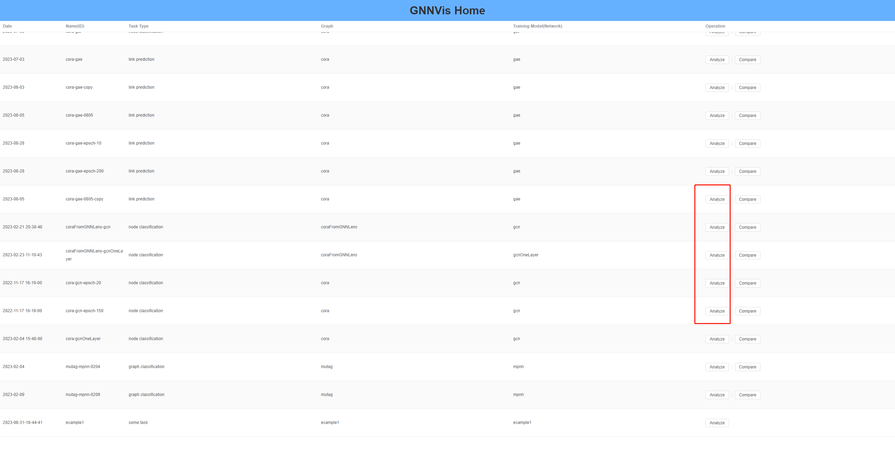

---

当用户点击按钮 `Compare（比较）` 时，列表将被过滤为一个子集，该子集仅包含来自完全相同的图形的数据集（如下图所示）。

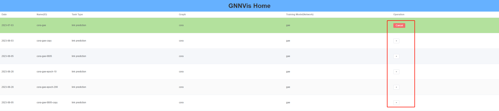

然后，用户可以单击该 `+` 按钮以进入两个模型结果比较的仪表板的布局。

## 仪表板布局

仪表板布局包含 3 个部分： `Header（头部）`、 `Main（主部）` 和 `Footer（底部）`。


### 头部

<span id="global_settings" ></span>

在 Header（头部）中，有一个**Global Setting（全局设置）**按钮，其中包含以下选项：

- 全局标签类型：是否在所有仪表板中使用 `true label（真是标签）` 或 `predict label（预测标签）`。切换时，标签将立即更改。
- 默认（全局）选择模式：由于许多视图已经实现了 `brush（刷选）` 启用结点选择的功能，用户可以切换此模式以决定连续选择行为或每次重新选择新的结点子集。请注意，此设置将在切换时立即更改。
- 何时重新缩放：每个仪表板中的每个视图都可以调整为任意大小（宽度、高度），并且坐标将同时更改。但出于渲染优化的考虑，用户可以选择在调整大小操作完成后重新缩放坐标。请注意，此设置将在切换时立即更改。
- 最近使用的仪表盘列表的最大长度：导航栏中显示的仪表板的最大长度。
- 设置触发模式：触发弹出设置菜单的手势。请注意，此设置将在切换时立即更改。

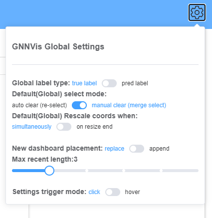

---

请注意，如果它是单个数据集（模型结果）的仪表板，则会有一个 `Add Comparison（添加比较）` 按钮。当点击它时，数据集将被自动过滤为与当前模型结果共享相同源图的数据集。如下图所示。


### 底部

在底部中，左侧部分显示最近访问的仪表板，默认情况下最大长度为 3。


将鼠标悬停在某个仪表盘按钮上，此仪表盘的[主视图](#principal_view)将会显示。单击按钮可以导航到目标仪表板。

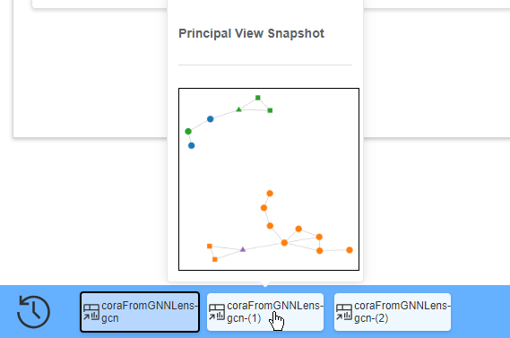

---

<span id="tree_view"></span>

在右下角有一个 **tree（树形）** 图标，在悬停时，它将显示仪表板的历史路径。当结点从旧仪表板中选择并过滤到新仪表板中时，两个仪表板之间的父子关系将被记录为层次数据，因此可以将其可视化为树或有向无环图（DAG）。

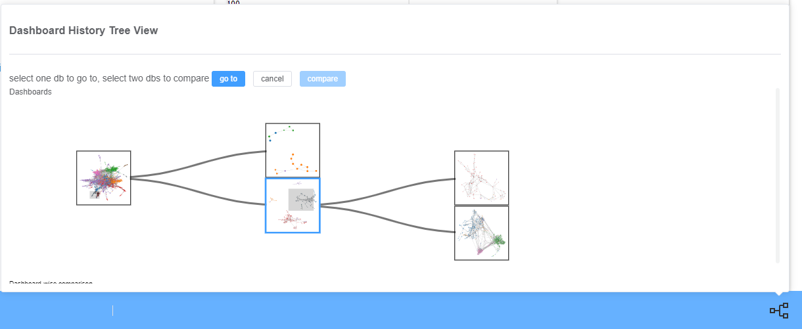

在树形视图中，每个仪表板都可以抽象为一个树结点，其关系可以看作是边。与导航栏一样，我们使用其[主视图](#principal_view)快照来表示每个仪表板。单击快照，然后单击 `goto` 以导航到目标仪表板。

---

对于仪表板方面的比较，用户可以单击两个快照，然后单击 `compare`，以创建新的仪表板进行比较分析。如下图所示。


与树中的结点不同，当点击比较仪表板的快照时，它将直接将用户导航至新仪表板。

# Dashboard 仪表板概念

<span id="dashboards"></span>

仪表板是选定结点子集的多视图可视化。第一个仪表板将模型结果中的所有结点视为输入，而后代仪表板将选定的结点及其相邻结点作为迭代过程中的输入。

仪表板由表头和主体组成。表头有标题、 `FILTER!（筛选）` 按钮、 `clear selection（清除筛选）` `restore views sizes（重置视图尺寸）`按钮、 `represent（表征）` 按钮、 `scatter legend（散点图图例）` 图标和 `settings（设置）` 按钮。主体被定义为[灵活布局](https://developer.mozilla.org/en-US/docs/Web/CSS/CSS_Flexible_Box_Layout/Basic_Concepts_of_Flexbox)以包括多个视图，这便于用户决定自己的视图排列。


## 仪表板的分类

目前，我们有**单一仪表板**一个模型结果可视化，以及将两个模型结果比较的比较仪表板。

此外，在[树形视图](#tree_view)中，用户可以选择两个仪表板来生成对两个仪表板进行比较的仪表板，以分析两个仪表板之间的差异

## 过滤和清除

<span id='filter_clear'></span>

当用户选择了一组感兴趣的结点，然后单击 `FILTER` 按钮时，将计算所选结点的邻居结点，并创建和呈现新的仪表板。


新仪表板一经创建，所选结点及其邻居将自然成为新仪表板的源结点，此仪表板中的大多数视图也是如此。

---

该 `clear` 按钮可以悬停，不同的结点选择条目将显示为列表，因为某些视图可能将不同的结点条目作为源。


用户可以检查每个条目的**描述**并决定清除哪一个。

单击该 `clear` 按钮时， 默认情况下将清除 `public` 结点条目。

或者，用户可以通过修改[全局设置](#global_settings)或[仪表板设置](#dashboard_settings)中的 `auto clear`，在每次选择新结点时将自动清除 `public` 结点条目。

## 还原视图大小

当用户单击 `restore view sizes` 按钮时，所有视图的大小都将调整为其原始大小，其内容也将重新缩放。

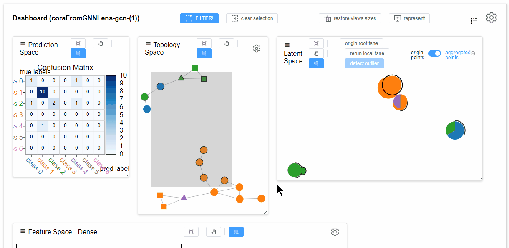

## 主体视图和表征仪表板

<span id="principal_view"></span>

在仪表板中，频繁交互或者被大量选择结点的视图可以体现关键特征，因此可以表征其所属的仪表板。我们称之为仪表板的**主视图**。

单击该 `represent` 按钮时，仪表板的大小将减小，并且仅显示主体视图。用户可以拖动所表示的仪表板，就像它浮动在所有层之上一样，以提供与其他仪表板的即时比较。

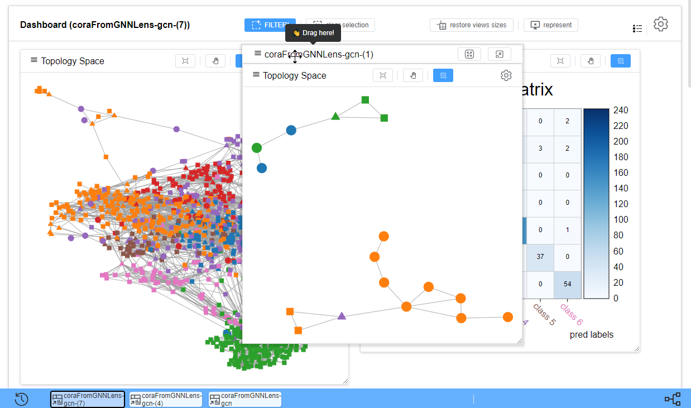

或者，当该 `represent` 按钮悬停时，将计算仪表板中所有视图的快照，用户可以单击其中一个视图，手动选择一个视图作为表征仪表板的主视图。


---

单击 `max` 按钮将仪表板最大化到其原始外观，然后单击 `min` 按钮将仪表板隐藏到页脚中的导航栏。

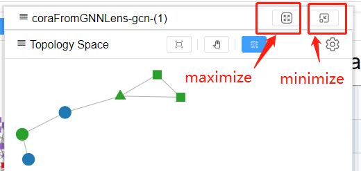

## 散点图图例

<span id="scatter_legends"></span>

许多视图使用不同的符号来显示不同的结点，因此需要一致且易于获取的图例。将鼠标悬停在图例图标上以显示它。


特别地，在仪表板方面的比较中，为了区分结点来自哪个仪表板，我们设计了半填充符号，如上图所示。简而言之，用于其他邻居步长的符号被类似地设计。

当圆圈表示整个图（Graph）而不是一个结点时，可能两个源仪表板都包含包含图的结点选择，因此我们使用圆圈中的扇区按百分比呈现此信息。

## 仪表板的其他设置

<span id="dashboard_settings"></span>

例如[全局设置](#global_settings)，仪表板有一些公共设置，这些设置仅在当前仪表板中有效。

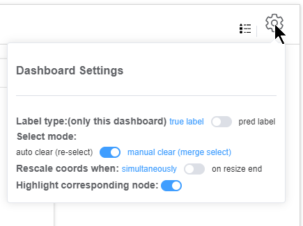

特别地，通过切换 `Highlight corresponding node`，用户可以确定是否在当前仪表板的视图中突出显示相同的结点或结点集，请参阅[结点突出显示](#nodes_highlighting)。这默认为`true`。

# Tasks & Views 任务和视图

<span id="tasks_and_views"></span>

目前我们支持 3 个主要任务：**结点分类**、**链接预测**和**图分类**。

我们还支持两个模型结果比较和两个仪表板比较（已选的结点集比较）。

给定不同的任务，仪表板将具有不同的视图配方，即*当前仪表板有哪些视图？*

## 视图的公共特征

所有视图都由头部和身体部分组成。在头部部分，有一些常用功能的按钮和一些可选设置的设置按钮。


### 可调整大小

所有视图都包装在可调整大小的框中。可以通过拖动框右下角的手柄来更改视图的大小，并且内容将自动重新缩放以适合大小。如下所示。

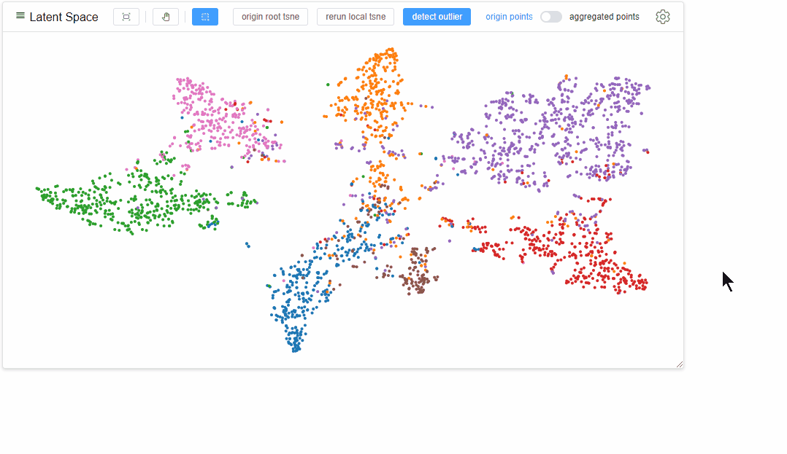

出于性能考虑，你可以更改在[全局设置](#global_settings)中或[仪表板设置](#dashboard_settings)中更改坐标重新计算的时机。

### 交换

用户可以通过拖动每个视图的标题来更改视图的排列和顺序。

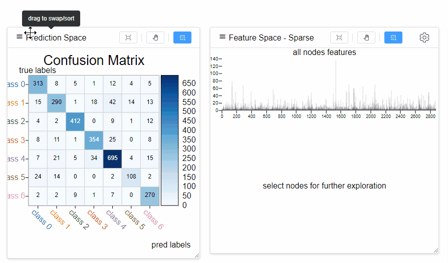

### 结点突出显示

<span id="nodes_highlighting"></span>

大多数视图都实现了结点突出显示。当鼠标在语义上悬停一个结点或部分结点时，其他视图将通过不透明度或其他视觉通道突出显示它们。


### 平移和缩放

大多数视图都实现了拖拽平移和缩放。默认情况下，用户可以通过鼠标滚动来放大或缩小。但平移行为与刷选冲突（请参见[结点选择](#nodes_selections)）。用户可以单击 `pan` 按钮以启用拖拽平移行为。从 `brush` 切换到 `pan` 不会清除结点选择。


用户可以单击 `reset zoom` 以将框中的内容放缩为适当的大小。


### 结点选择

大多数视图都实现了结点选择行为，比如在许多散点图中的**d3-刷选**和一些直方图中的**双击**操作。一旦选择了感兴趣的结点，它们将在当前仪表板中的各个视图中相对应地呈现，其中在散点图中通常以黑色圆圈呈现。

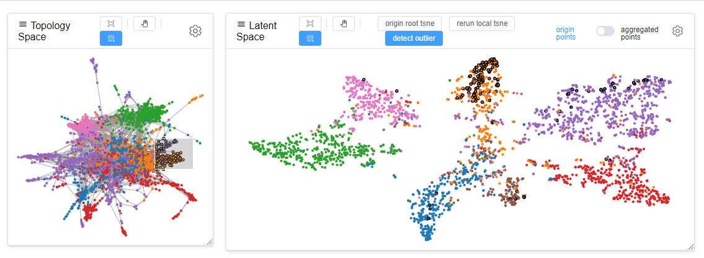

通常，单击 `brush` 按钮可启用笔刷行为。


**注意**：一些视图可能有不同的结点条目作为源或目标，这看起来像是第二次或第三次的结点选择。

**注意**：图分类中，当某些结点被选中时，它们可能无法组成一个完整的图，但在许多情况下，我们仍然按照完全图计算。

### 邻居区分

<span id="neighbor_discrimination"></span>

当用户选择了一些结点并[FILTER](#filter_clear)将其用于创建新仪表板时，将计算所选结点及其步长邻居，它们将一起成为新仪表板的源结点。因此，区分所选结点及其邻居是非常重要的。

我们使用不同的符号来编码不同的步长邻居。以下图为例，圆（●）是选定的结点（来自父仪表板），三角形（▲）是 1 阶邻居，矩形（■）是 2 阶邻居。


注：所有散点图视图都使用了此视觉编码，有关更多符号，请参阅[散点图图例](#scatter_legends)。

### 仪表板区分

<span id="dashboard_discrimination" ></span>

当用户比较两个仪表板时[历史树视图](#tree_view)，需要区分结点是仪表板-0 还是仪表板-1。

对于散点视图，我们在符号上使用不同的填充样式来编码仪表板源。以下图为例，左边的填充符号（◐）是仪表盘-0 的结点，右边的填充符号（◑）是仪表盘-1 的结点，如果仪表盘-0 和仪表盘-1 都选中了一个结点，则该结点将被完全填充（●）。此规则适用于各阶邻居符号。

请注意，如果某个结点是 仪表盘-0 中所选结点的 1 阶邻居，但却是 仪表盘-1 中所选结点的 2 阶邻居，则我们总是首先选择较短的路径，因此该结点的符号将是完全填充的三角形。

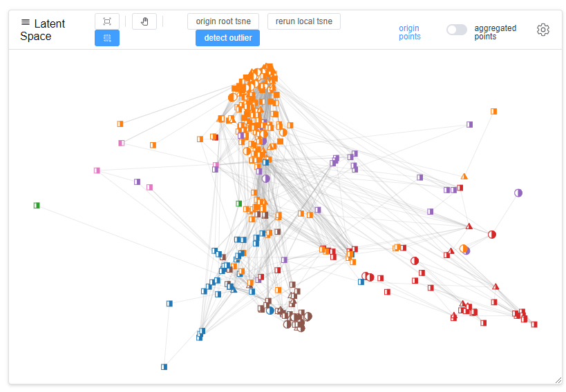

如果符号表示整个图，请参阅[散点图图例](#scatter_legends)以了解如何按百分比填充圆圈。

---

对于混淆矩阵视图，我们通过在一个单元格中绘制两个半球来区分来源，左边的表示仪表板-0，右边的表示仪表板-1。

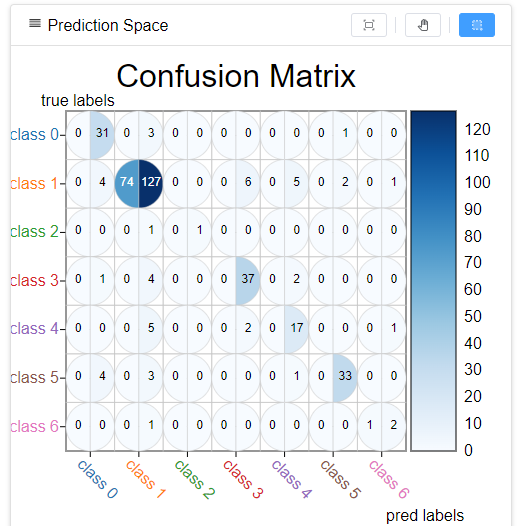

---

对于直方图视图，我们通过简单地并排显示图表来区分源，它们的 X 轴和 Y 轴都是对齐的。


### 模型结果区分

当用户在一个仪表板（两个模型比较的仪表板）中比较两个模型结果时，必要情况下，我们将通过双视图可视化一些空间。

两个模型结果必须共享一个原点图，因此，只需一个拓扑视图和一个特征视图（如果它有特征信息）就足够了。但是两个模型结果具有不同的隐空间和预测空间，这些空间都需要两个视图。

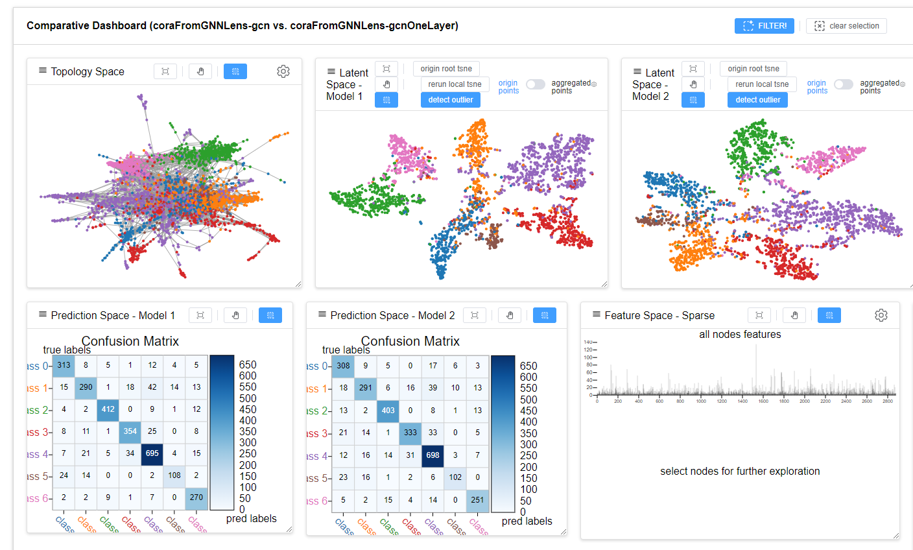

有一些视图仅为两个模型结果的比较而设计，如[比较排名视图](#comparative_rank_view)和[比较极坐标视图](#comparative_polar_view)等。

## 3 个任务的视图

在本节中，我们将逐一介绍在 3 个任务中**共同**使用的视图。

- [拓扑视图](#topology_view)
- [隐空间视图](#latent_space_view)
- [拓扑-隐空间密度视图](#topo_latent_density_view)
- [比较排名视图](#comparative_rank_view)
- [比较极坐标视图](#comparative_polar_view)
- [稠密特征视图（针对结点）](#dense_feature_view_for_node)
- [稀疏特征视图（针对结点）](#sparse_feature_view_for_node)

### 拓扑视图

<span id="topology_view"></span>

拓扑视图可视化当前仪表板的整个图形的拓扑结构（仅限当前仪表板的结点），使用力导向布局，该布局是在创建仪表板时计算的。


<span id="node_link_common_setting"></span>

在其设置中，用户可以决定是否显示边，并设置边的不透明度和结点半径。如果视图所属的仪表板不是第一个仪表板（根仪表板），则用户可以决定是否使用不同的符号显示邻居信息。请参考[邻居区分](#neighbor_discrimination)

> 注意：许多包含结点和边的视图都实现了类似的设置。

### 隐空间视图

<span id="latent_space_view"></span>

隐空间视图可视化 GNN 训练模型的隐藏层的结点嵌入的降维。

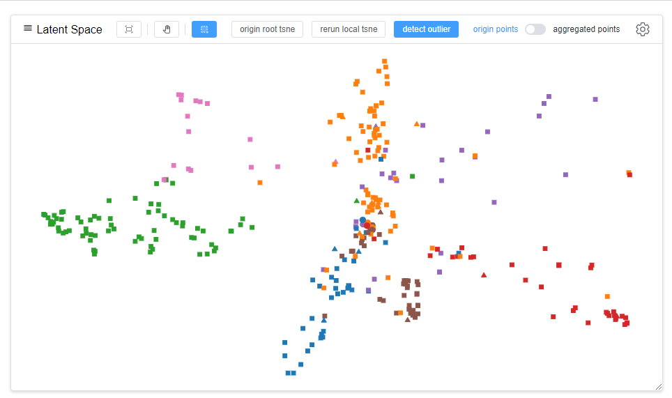

- 数据：通常第一个仪表盘中的视图显示的是后端计算的数据，而后代仪表盘中的视图默认复制第一个仪表盘的坐标，用户可以选择重新运行本地（当前仪表盘）的计算。
- 聚合：用户可以聚合点，以获得更多的一目了然的可视化效果。每个饼图中的扇区对不同标签的结点的比例进行编码，并且每个饼图的半径对该饼图内的结点的总数进行编码。链接也可以聚合。用户可以在“设置”中更改用于聚合的网格半径。
  - 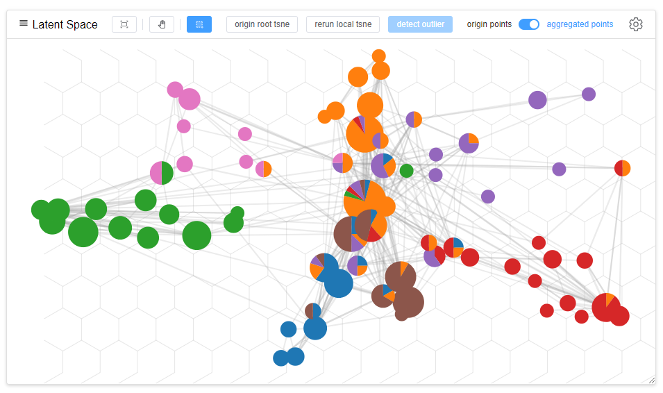
- 边缘点检测：Click `detect outlier` 可以通过算法自动选择一些边缘结点。
- 设置：在“设置”中，用户可以设置聚合属性、结点和边（请参见[this](#node_link_common_setting)）以及用于计算降维的超参数。它们很容易理解。
  - 

### 拓扑-隐空间密度视图

<span id="topo_latent_density_view"></span>

此视图将结点选择及其步长邻居（仅限当前仪表板）作为输入，这意味着视图将一直等待，直到用户选择某些结点。然后，它用结点和边渲染局部的拓扑结构，并使用灰色插值来编码隐空间中的距离，有关算法参见本小节的“数学”部分。

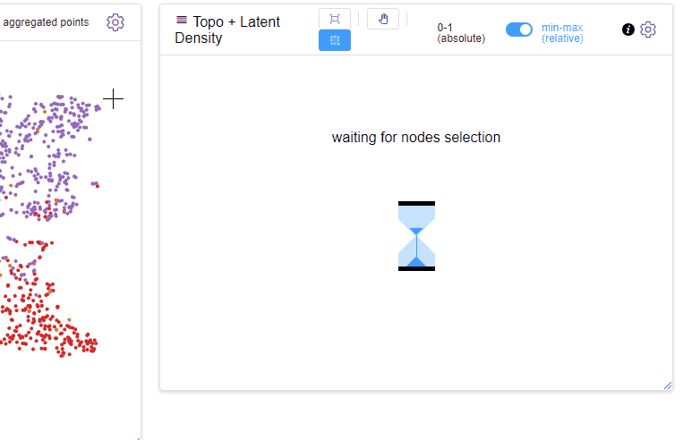

用户可以在插值的相对域范围或绝对域范围之间切换，因为有时距离差异并不明显。

与[拓扑视图](#topology_view)相比，此视图可以帮助用户直接检查结点选择及其邻居。

虽然这些结点可以过滤到新的仪表板中，但有时我们需要直观地了解背景结点（当前仪表板中的所有结点）与所选结点之间的关系。而新仪表板仅包含选定的结点（和邻居）。

数学：

- 如果仪表板**不**用于两个仪表板之间的比较，我们假设结点选择（及其阶邻居）为$S$，并且当前仪表板中的所有结点构成$G$，差集为$(G-S)$。假设$S(i)$表示中$S$的$i$第个结点，我们有关于$S(i)$的以下数据：

  $$datum(S(i))= \frac{1}{len(G-S)}\sum_{j}^{len(G-S)} dist(S(i), G(j))$$

- 如果仪表盘用于仪表盘之间比较，我们假定从仪表盘0所选点集（及其邻居）为 $S_{0}$， 长度为 $l_{1}$；从仪表盘1所选点集（及其邻居）为 $S_{1}$ ， 长度为 $l_{1}$。假设 $S_{0}(i)$ 代表$S_{0}$中的第$i$个结点 , $S_{1}(i)$代表$S_{1}$中的第 $i$ 个结点。

  关于 $S_{0}(i)$ 的数据：

  $$ datum(S_{0}(i)) =\frac{1}{l_{1}} \sum_{j}^{l_{1}} dist(S_{0}(i), S_{1}(j)) $$

  同理，关于$S_{1}(i)$的数据：

  $$ datum(S_{1}(i)) = \frac{1}{l_{0}}\sum_{j}^{l_{0}} dist(S_{1}(i), S_{0}(j)) $$

### 比较排名视图

<span id="comparative_rank_view"></span>

此视图专用于模型结果之间的比较。给定两个模型结果的隐空间数据，我们想评估两者之间的差异。但是两者的距离计算是要统一的（不同的空间不能直接比较）。因此，我们设计了排名算法，当结点 $n_{i}$ 被选中, 我们有空间0中的结点 记作 $S_{0}$，空间1 中的结点记作 $S_{1}$, 令 $(S_{0}-n_{i})$ 表示空间0中除了 $n_{i}$ 的点，然后我们可以得到空间0中的距离：

$$dist(n_{j}) = dist(n_{i}, n_{j}), \space where \space n_{j} \in (S_{0}-n_{i})$$

空间 1 中的距离：

$$dist(n_{j}) = dist(n_{i}, n_{j}), \space where \space n_{j} \in (S_{1}-n_{i})$$

在距离各自计算完成后，我们可以给它们排序得到排名，也即距离值在排序后的索引值。

如果点集 $G$ 被选中, 我们可以计算平均排名：

$$avg\_rank(n_{j}) =\frac{1}{len(G)} \sum_{i}^{len(G)} dist(n_{i}, n_{j}),\space where \space n_{j} \in (S_{0}-n_{i}) or (S_{1}-n_{i}) $$

或者使用点集在隐空间的中心点作为单个点。

我们在两个空间中用x轴或y轴上的线性位置对两个排名数据进行可视编码，并且仍然使用颜色来编码标签，因此我们有：

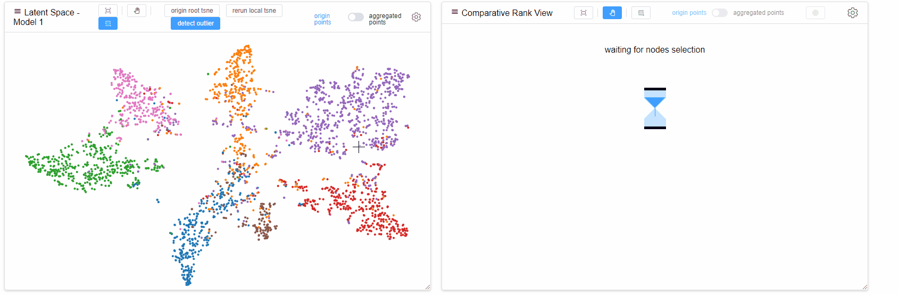

显然，当结点在直线$y=x$附近集中时，意味着相对于所选结点在两个空间之间的差异更小。

算法可以在设置中设置：

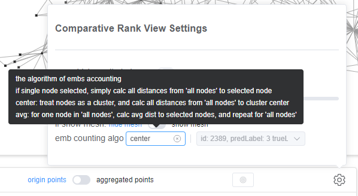

排名视图中有两条斜率为 1 的边界线，可以拖动边界线以便于`brush` 选择那些不“接近”$y=x$的离群结点。如下所示。


请注意，与从源视图（排名视图的计算源）中选择的结点相比，在排名视图中选择的结点将会填充其他结点条目。有关节点条目参见[结点选择](#nodes_selections)。

### 比较极坐标视图

<span id="comparative_polar_view"></span>

为了让用户从两个模型结果中看到所选结点在隐空间和拓扑空间中的差异，我们设计了 `Comparative Polar View`。

我们使用极角来编码隐空间中的差异，从左到右逆时针方向，其中算法与中[比较排名视图](#comparative_rank_view)的算法相同，并使用极半径来编码拓扑空间中的距离，其中算法可以在[汉明距离](https://en.wikipedia.org/wiki/Hamming_distance)[雅卡尔指数](https://en.wikipedia.org/wiki/Jaccard_index)和最短路径中选择。


此外，此视图仅计算和渲染步长邻居，并且步长信息也由半径递增的圆环显示。请注意，短路路径可能与步长完全相同。

这些点也可以聚合，和[隐空间视图](#latent_space_view)中类似。


请注意，与从源视图（极坐标视图的计算源）中选择的结点相比，在极坐标视图中选择的结点将填充其他结点条目。关于结点条目参见[结点选择](#nodes_selections)。

> 一个实验特性：点击 `click to switch` 可以对调隐空间和拓扑空间两种编码。

### 稠密特征视图（针对结点）

<span id="dense_feature_view_for_node"></span>

如果数据集或模型结果包含密集结点特征，则它们将被可视化为多个直方图。

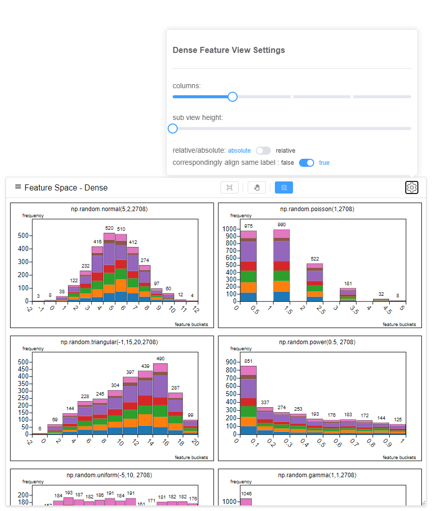

一个直方图表示一个特征，其中特征值被计数为频数直方。我们使用了彩色堆叠柱来对该直方中具有不同标签的结点进行分组。点击一个色块可以将相同的色块对齐到底部。


将鼠标悬停在彩色块上时，块中的结点将在当前仪表板的各视图中突出显示，请参见[结点突出显示](#nodes_highlighting)。双击彩色块时，结点将被选中，请参见[结点选择](#nodes_selections)。双击柱上方的数字时，将选中整个柱中的结点。

此视图由[网格布局](https://developer.mozilla.org/en-US/docs/Web/CSS/CSS_grid_layout/Basic_concepts_of_grid_layout)实现，并且可以滚动。直方图的列数高度都可以在“设置”中设置。

 

有关仪表板方面的比较，请参阅[仪表板识别](#dashboard-discrimination)

### 稀疏特征视图（针对结点）

<span id="sparse_feature_view_for_node"></span>

此视图可视化稀疏结点特征（如果有）。首先，对于所有结点的特征，柱状图用水平位置（X 轴）对各维度进行均匀编码，并用条形高度对某维度上的累积的值进行编码。

然后，对于所选择的结点，这些结点的特征值将在每个维度上累积，并呈现为具有灰度值的矩阵条带。并且此视图以相同的方式，呈现所有结点特征，以及所有结点特征与所选结点特征之间的差。


有时特征过于稀疏，灰色过浅不利于辨明，因此我们添加了设置来调整灰度范围。（请注意下图中底部的条带）


柱状图和条带可以通过鼠标滚动同步放大或缩小，以便用户更仔细地查看稀疏特征。


对于仪表板方面的比较，我们分别可视化这两个结点选择（集合）的特征，以及它们的差异。

## 结点分类视图

在本节中，我们将介绍专用于任务**结点分类**的视图

- [混淆矩阵（用于结点）](#confusion_matrix_for_node)

### 混淆矩阵（用于结点）

<span id="confusion_matrix_for_node"></span>

混淆矩阵将结点分类的预测结果可视化，行表示真实标签，列表示预测标签。在每个单元格中，计数直接以数字显示，并以颜色编码。

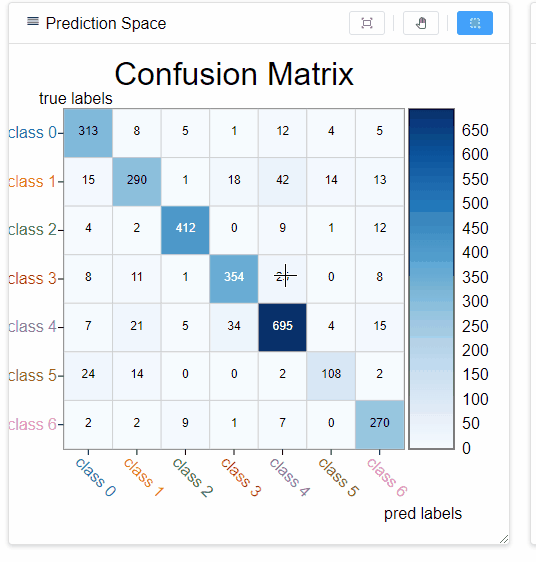

默认情况下 `brush` 是启用的，当笔刷区域不能完整覆盖单元格时，它可以自动扩展。[结点突出显示](#nodes_highlighting)也由鼠标悬停支持。

对于两个模型结果的比较，我们只是简单地添加了另一个视图。有关仪表板方面的比较，请参阅[仪表板区分](#dashboard_discrimination)

## 链接预测视图

在本节中，我们将介绍专用于任务**链接预测**的视图

- [链接预测视图](#link_prediction_view)

### 链接预测视图

<span id="link_prediction_view"></span>

此视图可视化所选结点的链接预测结果，因为呈现所有结果会变成一团糟。


至于结点，我们用不同的符号编码不同的步长邻居，见[邻居区分](#neighbor_discrimination)或[散点图图例](#scatter_legends)，并用颜色标记结点。

对于链接（边），**真实链接**用<span style="color:#555">灰线</span>编码，**true allow 链接**（包含在原点图中，预测正确）用<span style="color:black">黑线</span>编码，**false allow 链接**（包含在原点图中，但预测错误）用<span style="color:red">红线</span>编码，**排名前 k 的推荐链接**（推荐链接）用<span style="color:#409eff">不同线宽的蓝色虚线</span>编码。

在“视图设置”中，用户可以更改：

- 要显示多少步长。（注意：这将导致重新渲染）
- 是显示真实链接还是预测链接。（注意：这两者是相互排斥的）
- 推荐链接的“k”是多少。（注意：这将导致重新渲染，并且，我们只考虑当前仪表板中的结点）

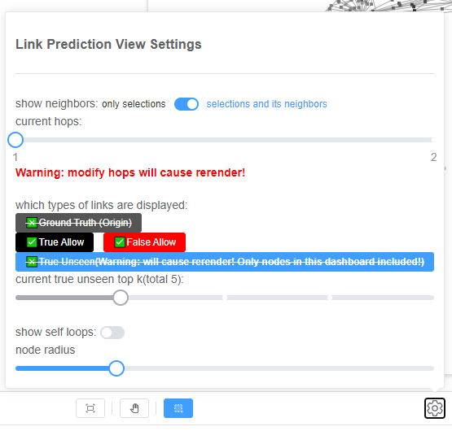

## 图分类视图

在本节中，我们将介绍专用于任务**图分类**的视图

- [拓扑视图（用于图）](#topology_view_for_graph)
- [隐空间视图（用于图）](#latent_sparse_for_graph)
- [混淆矩阵视图（用于图）](#confusion_matrix_for_graph)
- [稠密特征视图（用于图）](#dense_feature_view_for_graph)

### 拓扑视图（用于图）

<span id="topology_view_for_graph"></span>

图的拓扑视图在可滚动网格布局中对各个图逐一可视化，每个外部矩形编码图真实标签（而非结点的标签），内部矩形编码图预测标签。


和[稠密特征视图（针对结点）](#dense_feature_view_for_node)类似，列数和高度可以手动设置。

---

如果用户选择一些不能形成严格完整图的结点，然后创建一个新的仪表板，我们仍然可以计算完整图，如下图所示，其中我们仍然可以将所选结点与其邻居区分开来。

 → 

---

对于两个模型结果比较，内部矩形可以表示两个不同的预测标签。简单地说，左边是模型0的，右边是模型1的，如下所示。

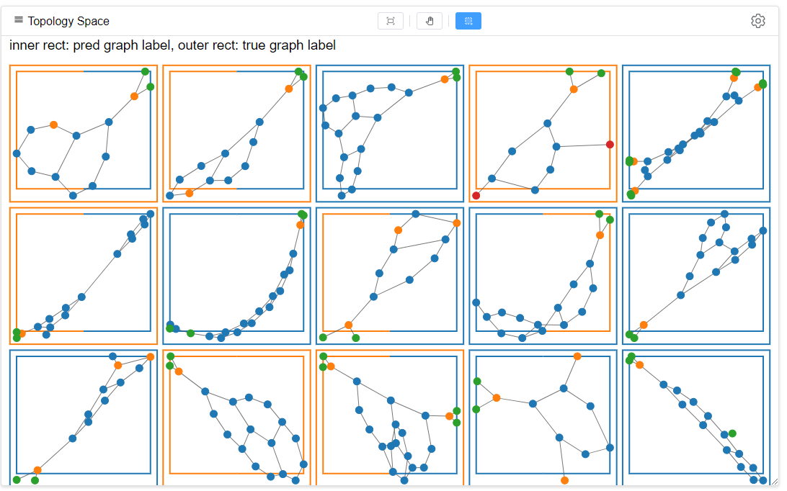

### 隐空间视图（用于图）

<span id="latent_sparse_for_graph"></span>
此视图可视化图嵌入的降维数据，类似于[隐空间视图（用于结点）](#latent_space_view)，但唯一的区别是这里的点表示整个图，而不是单个结点。

结点选择和突出显示仍然有效，但区别是，当用户这样做时，其他视图中的相应选择或突出显示将是所选或所突出的图的所有结点。


注意：在图分类中，结点和图都应当有嵌入。

注意：当从其他视图中选择某些结点时，它们可能无法组成完整图，但我们仍然按完整图计算。

---

对于[仪表板方面的比较](#dashboard_discrimination)，用户可能从两个仪表板中选择结点的结点都能（完全地或部分地）组成同一个图，因此图的来源可能包含两个。所以我们用百分比填充这个圆圈。左边的部分表示有多少结点来自仪表板 0，而右边的部分表示有多少结点来自仪表板 1. 如下所示。

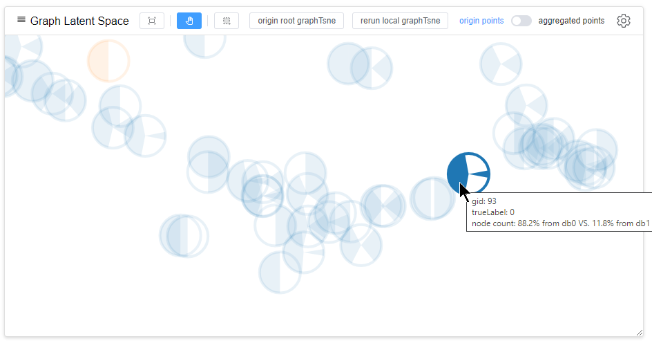

### 混淆矩阵（用于图）

<span id="confusion_matrix_for_graph"></span>

此视图类似于[混淆矩阵（用于结点）](#confusion_matrix_for_node)。唯一的区别是我们计算的是图的数量而不是结点的数量。

### 稠密特征视图（用于图）

<span id="dense_feature_view_for_graph"></span>

我们认为图形特征往往是用户定义的，这意味着特征可以在分析过程中通过 `python` 或 `backend` 异步计算，或者用户在分析过程中受一些新获得的知识启发并手动生成。

因此，我们设计了一个按钮 `fetch` 来获取图形特征，以便与后端计算结果保持一致，该按钮可以随时点击。


其他功能与[稠密特征视图（针对结点）](#dense_feature_view_for_node)相同，不同之处在于此直方图是在图上而不是结点上统计的。

> 目前，我们只支持图形的稠密特征。

# 数据格式描述

## 数据集

1. 类型：文件夹

2. 简述：该文件夹用于存放一个数据集的多个文件，文件夹的名称即数据集的名称，也可当作ID，必须唯一，因为它将作为路由路径的一部分。

3. 生成方式：由python生成。当jupyter环境生成整个工程文件夹（通常是一个vue-project的前端工程文件夹）时，在根路径的public文件夹下存放这些数据集文件夹。

4. 命名方式：数据集原本的名称-训练模型名称-其他信息，小写英文字母。

   > 例如：cora-gcn-epoch50、mutag-mpnn-20230331

5. 每个数据集应包含以下文件：

| No |                 File name | Description               |
|:--:|--------------------------:|:--------------------------|
| 1  |                graph.json | 📌 必须                     |
| 2  |       node-embeddings.csv | 📌 必须                     |
| 3  |   prediction-results.json | 📌 必须                     |
| 4  |      graph-embeddings.csv | ✅ 可选（仅多图任务）               |
| 5  |       initial-layout.json | 📌 必须                     |
| 6  |            supplement.txt | ✅ 可选                      |
| 7  |   graph-custom-index.json | ✅ 可选（用户自定义指标）             |
| 8  |   node-dense-features.csv | ✅ 可选（结点的稠密特征）             |
| 9  | node-sparse-features.json | ✅ 可选（结点的稀疏特征）             |
| 10 |           true-labels.txt | ✅ 可选（仅当连接预测和图分类时，结点的真实标签） |

### 1. graph.json

1. 类型： Json 文件，主要参考 `NetworkX` 的数据格式
2. 描述：关于图的原始数据
3. 文件样例：

```json
{
    "directed": true/false,  // 是否有向图
    "multigraph": true/false,  // 是否含有多个子图
    "graphs": {  // 仅限多图：此处保存了每个子图的信息
        "0": {  // n 个子图的 id（从 0 到 n-1，升序）
            "id": "0",
            "label": "",  // 可选
            "nodes": [  // Array<int>
                0,1,5,17,29,33, //...
                // 每个整数表示该子图中节点的全局 ID
            ],
            "edges":[ // Array<int>
                0, 9, 50, 1190, //...
                // 就像「节点」一样，每个整数表示该子图中某条边的全局ID
                // 如果整个图是无向的，则每个边表示两个方向
            ]
        },
        "1": {
            // ...
        },
    },
    "nodes": [ // Array
        {   
            "id": 0, 
            "label": 8 // 可选：节点的标签
        },
        //...    
    ],
    "edges": [
        {
            "source": 0,  // 边的起点
            "target": 1,  // 边的终点
            "eid": 0,     // 边的 id
            "label": 0    // 可选：边的标签
        },
        //...
    ],
    "edgeDict": [  // 二维数组
        // 长度与点列表的长度相同
        // 对于每个 node (按索引），直接相连的边和一阶邻接点
        [ // 第 0 个 node 的邻接边、点
          // 可选，如不提供则前端自行计算
            { "nid": 1, "eid": 0 }, // 1 号 node 通过 0 号边和 node0 相连
            { "nid": 3, "eid": 1 }, // 1 号 node 通过 0 号边和 node0 相连
            { "nid": 7, "eid": 2 }, // 7 号 node 通过 2 号边和 node0 相连
            //...
        ],
        [ // 第 1 个 node 的邻接边、点
        //...
    ],
}
```

### 2.node-embeddings.csv

1. 类型：CSV 文件
2. 描述：嵌入空间中节点的训练数据通常由 MLP 的最后一层生成。文件中的每一行都表示一个节点的嵌入数据，节点的顺序与 `graph.json` 中的节点顺序相对应。

> 一般按照 id 递增的顺序即可。对于每一行中的数据各维度用英文逗号分隔（可有空格，最后一维不加逗号）。不包含行号，结点 id 等任何其他数据。

3. 文件样例：一个5维空间的示例

```csv
0.130,0.307,0.044,0.032,0.166
0.208,0.510,0.062,0.086,0.112
0.171,0.296,0.262,0.097,0.161
0.104,0.357,0.151,-0.125,0.278
0.374,0.109,-0.143,-0.171,-0.080
//...
```

### 3.prediction-results.json

1. 类型: Json 文件
2. 描述：模型预测的输出。三种不同的任务具有不同的格式。

#### 节点分类

```json
{
    "taskType": "node-classification",
    "numNodeClasses": 7,  // int: 节点分类数
    "predLabels": [  // Array<int>: 预测节点的标签，顺序与 graph.json 中节点的顺序相同
        0, 1, 2, 3, 4, 5, 6,  //...
    ],
    "trueLabels": [  // Array<int>: 节点的真实标签，顺序与 graph.json 中节点的顺序相同
        0, 0, 2, 3, 4, 5, 5,  //...
    ]
}
```

#### 边预测

```json
{
    "taskType": "link-prediction",
    "trueAllowEdges": [  // Array<Array<int, int> >
        [0, 1],  // 存在于原图，并被正确预测的边
        [0, 2],  // 表示为 [起点 id, 终点 id]
        //...
    ],
    "falseAllowEdges": [  // Array< <int, int> >
        [0, 18],  // 存在于原图，但未被正确预测的边
        [1, 39],  // 表示为 [起点 id, 终点 id]
        //...
    ],
    "trueUnseenTopK": 5,  // int: 原图中没有的但推荐出来的边，由一个分数排序决定
                          // 表示取前 k 个
    "trueUnseenEdgesSorted": {  // 原图中不存在，但由模型推荐的边
        "11": [44, 161, 3, 19, 339],  // 每个键表示一个节点 ID，其值为 Array<int>，长度与 "trueUnseenTopK" 相同
        "16": [145, 122, 259, 321, 324],  // 每个 int 表示一个节点 ID，对应的推荐边按分数降序排序
        //...
    }
}
```

#### 图分类

```json
{
    "taskType": "graph-classification",
    "numGraphClasses": 7,  // int: 图分类数
    "graphIndex": [  // Array<int> (可选): 每个子图的 ID (顺序与 graph.json 中 graphs 中的键的顺序相同)
    ],               // 若不提供，默认子图 ID 为 0~n-1 (升序)
    "predLabels": [  // Array: 预测的子图标签 (顺序与 graph.json 中 graphs 中的键的顺序相同)
    ],
    "trueLabels": [  // Array: 真实的子图标签 (顺序与 graph.json 中 graphs 中的键的顺序相同)
    ],
    "phaseDict": {  // Dict (可选): 模型训练流程中，使用子图的不同阶段
        0: "train",
        1: "valid",
        2: "predict"
    },
    "phase": [  // Array<int>: 子图作用的阶段
        1, 2, 0, 0, 0, 1, 1, 0,  //...
    ]
}
```

### 4.graph-embeddings.csv

1. 类型: CSV 文件
2. 描述：仅当图分类任务有效。它表示嵌入空间中每个图的训练数据。文件中的每一行代表一个图的嵌入数据，图的顺序对应于 `graph.json`。每一行中的数据各维度用英文逗号分隔（最后一维不加逗号）。不包含行号，结点 id 等任何其他数据。
3. 样例: 5 维空间的图嵌入

```csv
0.244,-0.146,0.252,-0.240,-0.302
-0.221,-0.431,0.214,0.153,0.007
0.147,-0.199,0.385,0.066,-0.250
0.110,0.171,-0.066,0.849,0.377
//...
```

### 5.initial-layout.json

1. 类型: Json 文件
2. 描述：一些计算繁琐的，初始的渲染数据。包括图的力导向图（Force Directed Layout）。嵌入空间数据的降维结果等
3. 计算方法介绍：
    - forceDirectedLayout: <https://github.com/d3/d3-force/tree/v3.0.0#d3-force>
    - Umap, Tsne: 可使用 python 中的 sklearn 库
4. 样例:

```json
{
    "forceDirectedLayout": [  // Array<Dict>: 长度等于 nodes 长度，存放图初始渲染时点的坐标
        {"id":0, "x":23.1, "y":50.3 },  // 和每个店的 ID 对应
        {"id":1, "x":44.5, "y":90.1 },
        //...
    ],
    "nodeEmbUmp": [  // Array< <int, int> >: 长度等于 nodes 长度，存放结点嵌入空间数据经过 Umap 降维（二维）后的数据，顺序和结点id对应 
       [1.334,5.132],
       //...
    ],
    "graphEmbUmp": [  // Array< <int, int> >: 长度等于 graphs 长度，存放图在嵌入空间的数据经过 Umap 降维（二维）后的数据，顺序和子图 id 对应
       [1.334,5.132],
       //...
    ]
}
```

### 6.supplement.txt

1. 类型: txt 文件
2. 描述：关于此数据集的其他任何信息，例如本次训练的超参数。由人工撰写，非程序生成。

### 7.graph-custom-index.json

1. 类型: Json 文件
2. 描述：用户自定义特征，由 `backend/custom_index.py` 计算
3. 样例:

```json
{
    "index_target": "graph" | "node",  // 特征类型（定义对象）
    "number_of_C": {  // 特征（指标）的名称
        "0": 14,  // KEY: 子图或点 ID, VALUE: 特征值
        "1": 9,
        "2": 9,
        "3": 16,
        "4": 6,
        ...
     },
     "number_of_F": {
         ...
     },
     ...
}
```

### 8.node-dense-features.csv

1. 类型: CSV 文件
2. 描述：结点的稠密特征。每个结点可能多个特征，但是每个特征都是一个数字（scala）。第一行是特征的名称（非必须）。后面 2~n 行和节点数量对应，值为结点特征
3. 样例:

```csv
feat-1,feat-2,feat-3
1.34,2.0,18.628
1.80,0.0,18.96
4.20,0.0,5.488
3.99,1.0,18.884
...
```

### 9.node-sparse-features.json

1. 类型: Json 文件
2. 描述：结点的稀疏特征
3. 样例:

```json
{
    "numNodeFeatureDims": 888,  // int: 特征的维度
    "nodeFeatureIndexes": [  // Array<Array<int> > 索引和点 id 对应
                             // 表示当前节点在所有维度中特征值非空的索引（从零开始）。
        [65, 77, 391, 801],  // 0 号点在特征的第 65、77、391、801 维有数据
        [30, 102, 887],      // 1 号点在特征的第 30、102、887 维有数据
        ...
    ],
    "nodeFeatureValues":[  // Array<Array<int> > 索引和点 ID 对应
                           // 在相应的特征维度上该点的值
        [1.2, 1.5, 1.8, 0.3],  // 0 号点在特征的第 65 维上值是1.2，在第 77 维上的值是 1.5，以此类推
        [0.2, 1.4, 1.5],       // 1 号点在特征的第 30 维上值是0.2，在第 102 维上的值是 1.4，以此类推
        ...
    ]
}
```

## Python 对象格式

调用如下函数以创建数据文件：

```python
GNNVis(
    graph,
    node_embed,
    node_dense_features,
    node_dense_features_name,
    node_sparse_features,
    link_pred_res,
    node_classify_res,
    graph_classify_res,
    graph_embed,
    gen_path,
)
```

各参数格式如下：

### graph

Python dict: 与 `graph.json` 相同

### node_embed

numpy.ndarray (2d)

### node_dense_features

(可选) numpy.ndarray (2d)

### node_dense_features_name

(可选) List: 结点稠密特征的名称

### node_sparse_features

(可选) Python dict: 与 `node-sparse-features.json` 相同

### link_pred_res

(可选) Python dict: 与 `prediction-results.json` 相同

### node_classify_res

(可选) Python dict: 与 `prediction-results.json` 相同

### graph_classify_res

(可选) Python dict: 与 `prediction-results.json` 相同

### graph_embed

(可选) numpy.ndarray (2d)

### gen_path

(可选) str: 数据文件路径 (`backend` 文件夹路径)
