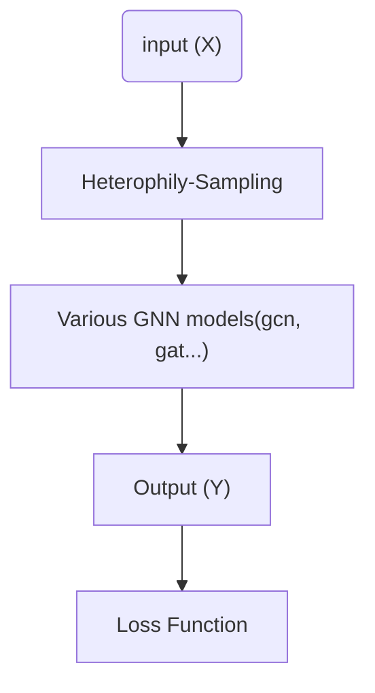

# Contents

- Heterophily-Sampling GNN(HSGNN)
- Datasets
- Environment Requirements
- Quick Start
- Experiment results (acc)

## Heterophily-Sampling GNN(HSGNN)

- **Introduction**

Heterophily-Sampling GNN(HSGNN) is the cutting-edge work at graph with Heterophily. It's a lightweight sampling algorithm that can be easily embedded into various GNN models.

- **Experimental Result**

We have achieved good results on some datasets.

| **Model**    | **Cora** | **Actor** | **Texas** |
| :----------- | :------- | --------- | --------- |
| GCN          | 87.18    | 40.18     | 76.97     |
| SAGE         | 86.90    | 34.23     | 82.43     |
| SOTA@1       | 88.71    | 41.75     | 93.28     |
| SOTA@2       | 88.57    | 41.71     | 92.91     |
| Ours (hsgnn) | 88.90    | 42.33     | 93.61     |

The paper of HSGNN is in the process of submission. For more details, please follow MindSpore and GraphLearning in the future

This repository contains a implementation of HSGNN based on MindSpore and GraphLearning

## Datasets

The experiment dataset Texas is based on Geom-GCN, which can extracted in https://github.com/graphdml-uiuc-jlu/geom-gcn/tree/master/new_data/texas

## Environment Requirements

- MindSpore >= 1.7.0
- GraphLearning >= 0.1.0

## Quick Start

CUDA_VISIBLE_DEVICES=0 python recommendation/hsgnn/vc_hsgnn_datanet.py --alpha 0.5 --K 2

## Experiment results

Texas dataset

Test acc: 93.4426 ± 1.2295